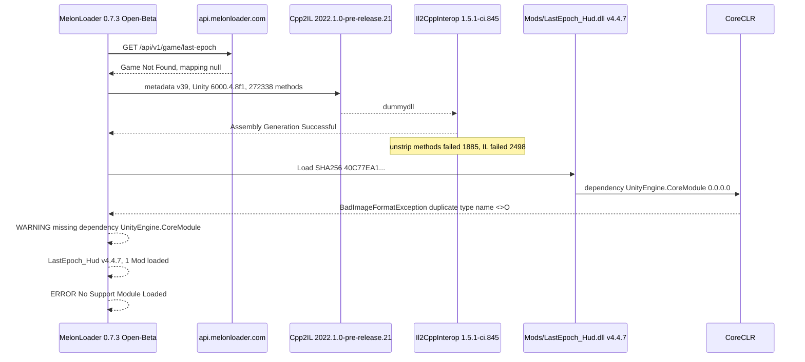
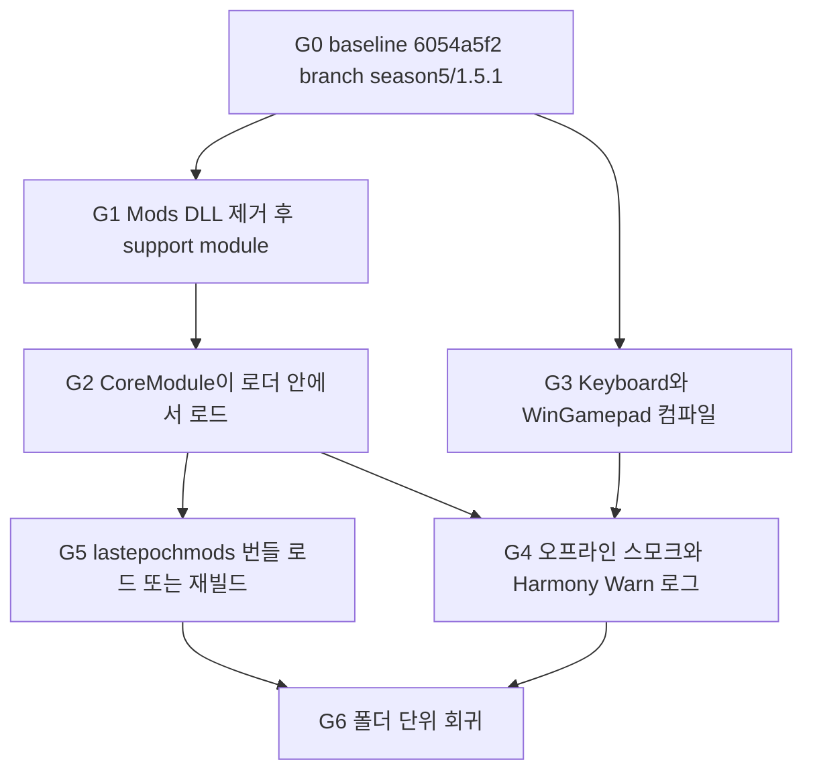
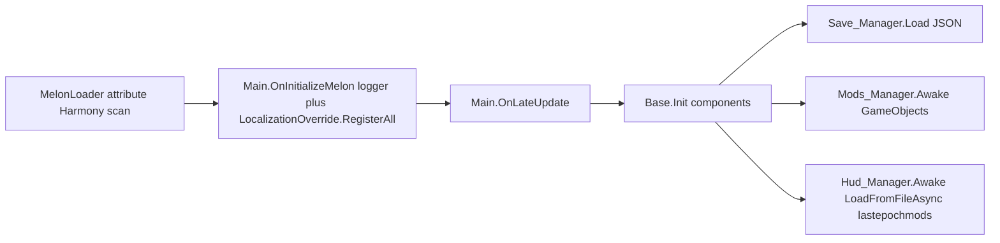

# Last Epoch Hud 1.5.1 (Season 5) 마이그레이션 계획

| 항목 | 값 |
| --- | --- |
| 문서 | LastEpoch_Hud 1.4 계열 트리 → 게임 1.5.1 시즌 5 대응 |
| 작성자 | (미정) |
| 날짜 | 2026-10-03 |
| 상태 | Draft |
| 작업 저장소 | `E:\dev\LastEpoch_Mods_fork`. `origin` = `git@github.com:naturalkei/LastEpoch_Mods.git` |
| 기준 커밋 | `6054a5f218594b7c8d632167ec6ac47fff9d7f46` (포크 `master`이자 RCInet `master`, 2026-04-15) |
| 문서 커밋 기준 | 포크 기본 브랜치 `main` = `6ef5130637df5401b416f150d9c1ce5557de28a3` (`chore: add docs`, 2026-10-03). `6054a5f2` 위에 `docs/build-patch.md`만 있다 |
| 조사에 쓰지 않는 클론 | `E:\dev\LastEpoch_Mods`. 그 클론의 `origin`은 RCInet이고, 조사 시점 HEAD는 `be5fbacd`로 `origin/master`보다 13커밋 뒤였다. 구현은 그 경로에서 하지 않는다 |
| 로컬 게임 | `E:\SteamLibrary\steamapps\common\Last Epoch`, Steam app `899770`, `buildid` `25672295` |
| 게임 식별자 | `Last Epoch_Data\build_hash.txt` = `bf5a46c674908886ecdabb6e9906b8a3bf81ec5b`. `app.info`는 회사명과 `Last Epoch`만 있어 Game Version은 `UNKNOWN` |
| 로더 | MelonLoader v0.7.3 Open-Beta, Hash `BDD43DC0F3893C208C95389B863AB61C967AE14204DA0DD8051647E754C8709B` |

이 문서는 계획만 담는다. 게임 설치본과 모드 동작 코드는 수정하지 않았다. 구현은 `## PR Plan`의 순서대로 한다.

## 진행 상태

2026-10-03 기준이다.

- 이슈 표와 마이그레이션 계획 초안을 썼다. 리뷰 1회에서 14건(critical 1, major 6, minor 5, nit 2)을 반영했다. 재검토는 이 문서 커밋 다음에 한다.
- 작업 트리를 `E:\dev\LastEpoch_Mods_fork`로 고정했다. 포크 `master`는 이미 `6054a5f2`이고, 기본 브랜치 `main`은 그 위에 `docs/build-patch.md`가 있는 `6ef51306`이다. `E:\dev\LastEpoch_Mods`의 `be5fbacd`는 사용하지 않는다.
- 로더 실패는 재현된 사실이다. G1(모드 DLL을 뺀 부팅)은 아직 실행하지 않았다. Harmony 전수 표와 `dotnet build`도 아직이다.
- 코드 포팅, 번들 재빌드, 세이브 스키마 변경은 시작하지 않았다.

## Overview

로컬 Last Epoch는 2026-10-01에 출시된 시즌 5 *Rage of the Frostborn*의 1.5.1 핫픽스(2026-10-02)이고, Unity `6000.4.8f1`, Il2Cpp metadata version 39다. upstream `RCInet/LastEpoch_Mods` `6054a5f2`(2026-04-15)는 Maxroll이 1.4.7 노트를 올린 2026-05-17보다 앞이고, 1.5 포트는 없다. 작업 포크 `naturalkei/LastEpoch_Mods`의 `master`는 그 커밋과 같고, 기본 브랜치 `main`(`6ef51306`)은 같은 커밋에 `docs/build-patch.md`만 더한다. 2023-08-03이라는 예전 `pushedAt`은 이 워킹 트리와 맞지 않으므로 쓰지 않는다.

2026-10-03 11:48의 `MelonLoader\Latest.log`는 어셈블리 생성 자체는 성공했다고 찍은 뒤 `Mods\LastEpoch_Hud.dll`을 올리면서 `UnityEngine.CoreModule`의 `BadImageFormatException: Duplicate type with name '<>O'`로 의존성 로드에 실패하고, `LastEpoch_Hud v4.4.7` / `1 Mod loaded.` 다음에 **`No Support Module Loaded!`** 를 찍는다. 이 상태는 부팅 성공이 아니다. `Il2Cpp` 지원 모듈이 없으면 `[RegisterTypeInIl2Cpp]` MonoBehaviour와 Harmony 대상이 게임에 붙지 않는다.

제안은 로더를 먼저 고치고, `6054a5f2`에서 분기한 뒤에 1.5.1 interop으로 `Keyboard`와 `WinGamepad`를 빌드하고, Harmony 대상을 증거로 keep / adapt / disable-behind-flag / remove-attribute로 분류한 다음, 플레이어가 읽는 `lastepochmods` 한 파일을 재검증하는 것이다. 게임플레이 훅은 시그니처가 실제로 바뀐 것만 고친다. 시즌 5의 신규 스킬·유니크·예언 규칙은 Il2Cpp 타입 이름 변경의 증거가 아니다.

## Background & Motivation

### 저장소가 가리키는 것과 게임이 가리키는 것

작업 트리 `E:\dev\LastEpoch_Mods_fork`의 `origin`은 `git@github.com:naturalkei/LastEpoch_Mods.git`이다. 2026-10-03 `git ls-remote`에서 `refs/heads/master`는 `6054a5f2`, `HEAD`와 `refs/heads/main`은 `6ef51306`이다. `6054a5f2`는 RCInet `master`와 같다. `E:\dev\LastEpoch_Mods`는 별도 클론으로, 조사 시점에는 `origin`이 RCInet이고 `master`가 `be5fbacd`라 13커밋 뒤였다. 그 13커밋은 한 종류가 아니다. 성능·소프트락·Library 추적 해제 외에 `8d79f8ee` Build(배포 번들과 `Latest\*.rar`)와 머지 `6edb5bb9`, `6054a5f2`가 있다. 해시만 골라 붙이면 배포 번들이 빠진다. 포크 `master`에는 이미 13커밋이 모두 들어 있다.

| 커밋 | 제목 | 이 포트에서 유지해야 하는 이유 |
| --- | --- | --- |
| `1668e4d6` | `git rm -r --cached AssetBundleExport/Library/` | `.gitignore`의 `/AssetBundleExport/Library/`와 맞춤. Library를 다시 커밋하지 않는다 |
| `9bd1c776` | Throttle `Check_DataChanged()` | `Save_Manager.Update`가 60프레임마다만 저장 비교 |
| `ca934b5d` | Disable `Mod_FixLowFPS` | `Mods_Manager.Awake`의 `enable_fix_lowfps = false` |
| `1ceb44a6` | HUD FPS cap이 `TryApplyMenuFPSLimit()`를 호출 | 직후 커밋이 이 접근을 제거한다. 최종본은 아래 행 |
| `1783e23c` | `PlayerLoopHelper` NRE 스팸 제거 | `Hud_Manager.instance.IsNullOrDestroyed()` 가드 |
| `699b9689` | FPS cap에서 graphics processor 경로 제거 | **기준 트리의 `Fix_HudFpsCap`은 `Application.targetFrameRate`만 사용** |
| `1ef43ed8` | NewItems locale 사전을 시작 시 한곳에 등록 | `LocalizationOverride.RegisterAll()`. `[HarmonyPatch`는 `699b9689`의 195에서 183(-12) |
| `6c4fbb23` | 성능 수정, `DiagnosticsDumper` | `OnLateUpdate`에서 `AttachIfEnabled()`. `[HarmonyPatch`는 183에서 186(+3). 추가분은 `Hud_Manager`의 `MainMenuPanel.OnOpen`, `Refs_Manager`의 `MonolithZoneManager.initialise`, `MonolithRunsManager.onRestZoneEnteredAfterEchoCompleted`. `Skills_AutoCast`의 echo 훅은 이 커밋 이전부터 있다 |
| `a4bc06b1` | ArakaalisFang 모델 누락 | 커스텀 아이템 6종 재검증의 전제 |
| `8d79f8ee` | `Build` | `lastepochmods` 2,089,779 → 2,088,876 바이트. `Latest\LastEpoch_Hud(Keyboard).rar`, `Latest\LastEpoch_Hud(WinGamepad).rar`도 변경. 성능 수정이 아니다 |
| `6edb5bb9` | Merge pull request #79 | 머지 커밋. 성능 수정으로 묶지 않는다 |
| `ea67b785` | 튜토리얼 아이템 자동 줍기 소프트락 회피 | `Items_AutoPickup_Items`의 `dropItemForPlayer` prefix만 `isTutorialItem()`이면 `return true`. `pickupItem`을 삼키는 prefix는 없다 |
| `6054a5f2` | Merge pull request #80 | `origin/master` tip. 머지 커밋. 성능 수정으로 묶지 않는다 |

워킹 트리 `be5fbacd`에는 위 수정이 없다. 예: `Mods_Manager.Awake`가 아직 `Mod_FixLowFPS`를 만들고, `Fix_PlayerLoopHelper`는 `Hud_Manager.instance?.enabled`이며, `Items_AutoPickup_Items`에는 `isTutorialItem()` 가드가 없다. **`be5fbacd`에서 1.5 작업을 시작하면 4월 수정을 떨어뜨린다.**

`LastEpochPath`는 `LastEpoch_Hud/LastEpoch_Hud.csproj`의 `HintPath`에만 있고, 저장소에 `Directory.Build.props`가 없으며 User/Machine 환경 변수도 비어 있다. 과거 `Build\Keyboard\net6.0\LastEpoch_Hud.dll`은 누군가가 프로퍼티를 주입해 만든 산출물이지, 지금 셸에서 `dotnet build`가 재현된다는 뜻이 아니다.

모드 버전 상수는 `LastEpoch_Hud/MelonLoader/Main.cs`의 `mod_version = "4.4.7"`이고 주석은 `//LastEpoch 1.3`이다. `Properties/AssemblyInfo.cs`는 `VerifyLoaderVersion(0, 6, 0, true)`, `AssemblyVersion` `1.0.0.1123`, `AssemblyFileVersion` `1.0.0.1123`, `AssemblyInformationalVersion` `0.0.0.1123`, Copyright 2025다. 세 어셈블리 속성은 이미 있다. 1.5.1 번호는 속성을 새로 만드는 변경이 아니다. Melon이 로그에 찍은 `v4.4.7 by Ash`가 `mod_version`이다. 설치본이 1.4.7에 맞춰 검증됐다는 뜻은 아니다. upstream 마지막 push(2026-04-15)는 1.4.7 노트 일자보다 빠르다.

### 로컬 1.5.1 부팅에서 확인한 사실

로그 파일: `E:\SteamLibrary\steamapps\common\Last Epoch\MelonLoader\Latest.log` (세션 2026-10-03 11:48:37).

- HostFXR `C:\Program Files\dotnet\host\fxr\10.0.5\hostfxr.dll`. Melon이 보고한 Runtime Type은 `net6`.
- Unity `6000.4.8f1`. Game Version `UNKNOWN` (`Last Epoch_Data\app.info`에 버전 번호 없음).
- RemoteAPI `https://api.melonloader.com/api/v1/game/last-epoch` → `Game Not Found`. `DumperVersion` / `ObfuscationRegex` / `MappingURL` 모두 null.
- Cpp2IL `2022.1.0-pre-release.21`. Il2CppInterop `1.5.1-ci.845+f03c8f4ae507d47ea814f3d11d1ec6b0391c1576`. Unity Dependencies `6000.4.8`.
- Metadata version **39**. 메서드 매핑 272338. potentially dead methods 538.
- Unstrip: 필드 681 복구 / 26 실패, 메서드 19920 복구 / **1885 실패**, IL unstrip 12429 성공 / 2498 실패. 실패한 메서드 이름은 로그에 없다.
- `Assembly Generation Successful!` 이후 `.\Mods\LastEpoch_Hud.dll` SHA256 `40C77EA11B76806C75511CA93389C1B4A56DCF23184DBC1B5949CDB237B7E473`.
- `BadImageFormatException` → inner `Duplicate type with name '<>O' in assembly 'UnityEngine.CoreModule'`.
- 경고: `LastEpoch_Hud` missing dependency `UnityEngine.CoreModule` v0.0.0.0. 그 다음 `1 Mod loaded.` 그리고 `No Support Module Loaded!`.

지원 모듈 파일은 없다가 아니다. `MelonLoader\Dependencies\SupportModules\Il2Cpp.dll`이 있다. 로그는 그 모듈이 초기화됐다는 줄을 찍지 않았다. **모드를 치우지 않은 실험만으로는, 실패가 모드 의존성인지 로더 자체인지 갈라지지 않는다.** `UserData\Loader.cfg`는 0.7 기본값이다. `force_regeneration = false`, `version_override` 빈 문자열, `harmony_log_level = "Warn"`. 이번 세션 로그는 그럼에도 `Assembly Generation Needed!`였다. 같은 생성기 버전으로 다시 돌려도 이번과 같은 DLL이 나올 가능성이 크고, 그 DLL은 이미 아래 로드 실험에서 CLR에 거부됐다.

`Mods` 폴더에는 이 저장소 밖의 파일도 있다. `LastEpoch_Hud.dll` (2026-04-14, 584192 bytes), `LastEpoch_Hud-1.4.rar` (2026-04-02, 2187913 bytes), `LastEpoch_Hud.7z`, `Desktop.Robot.dll` (2023-07-11). rar 안의 파일 목록은 이 문서에서 풀지 않았다. 게임 폴더 산출물을 git에 넣지 않는다.

### 시즌 5 / 1.5.1에서 모드에 의미 있는 변경

연 페이지:

- `https://lastepoch.com/1-5/patchnotes` 는 이 환경에서 SPA 셸(`Loading...`)만 반환했다. 본문은 확인하지 못했다.
- `https://lastepoch.com/1-5-1/patchnotes` 본문은 확인했다 (2026-10-02).
- 스킬 이름은 Maxroll 기사 *Last Epoch Season 5 New Skills* (2026-09-23, `https://maxroll.gg/last-epoch/news/last-epoch-season-5-new-skills`)와 1.5.1 노트의 `Dreamslash` 항목으로 확인했다. 포럼 스레드 `https://forum.lastepoch.com/t/season-5-rage-of-the-frostborn-patch-notes/81789` 는 노트가 웹사이트로 옮겼다는 안내와, 인용된 문장 `Fully re-localized Korean language`만 확인했다. 1.5 패치 노트 전문을 읽은 것으로 치지 않는다.

확인한 게임플레이 (타입 rename의 증거가 아님):

- 시즌 5 출시 2026-10-01 11:00 CDT. 인카운터 Rage of Morditas, 피나클 보스 Morditas. 1.5.1 노트는 Demigod's Ascendance 조명 버그와, Yrun, Champion of Morditas 히트박스 안에서 `Dreamslash`로 끼는 문제를 고친다고 적는다.
- 신규 마스터리 스킬 3개로 각 마스터리가 스킬 5개를 채운다. **Radiant Lance** (Paladin, Sentinel 트리 15포인트, 방패에서 발사), **Summon Tide Elemental** (Shaman), **Dreamslash** (Bladedancer). Water Spout는 Shaman 스킬 이름이 아니라 Tide Elemental / 토네이도 상호작용 노드 쪽으로 이차 자료에 나온다. 노드 구성을 이 문서에서 확정하지 않는다.
- 유니크 16개, 세트 2개, Nexus UI, Circle of Fortune 예언 리롤 제거(보상 타입을 고르면 Favor로 채움, Lens/Telescope 유지), Merchant's Guild 바자 UI 재구성. 모드가 바자 자동화를 새로 만들지 않는다.
- 1.5.1: Legacy/Offline도 Pinnacle Morditas 도전 가능. Escape가 다시 열린 패널을 모두 닫음 (1.5 회귀 수정). Lens of Tyranny 충전율 수정. CoF 랭크 3가 omen idol 대신 일반 idol을 주던 문제 수정. 에코를 나갔다 들어오면 Bonus Stability 표시가 틀리던 문제 수정. 퀘스트 클릭 시 지도 포커스. 게임패드에서 가격 인하 입력. 한국어 연령 등급 화면 추가.

모드 코드와의 접점만 남긴다. `Hud_Manager`의 `KEYBOARD` 블록은 일시정지 HUD가 열려 있을 때 Escape로 `Hud_Base.Btn_Resume`을 누른다 (`LastEpoch_Hud/Scripts/Hud_Manager.cs`). 1.5.1의 Escape 수정과 동시에 돌면 패널이 안 닫히거나 HUD가 먼저 먹을 수 있다. 이건 런타임 재검증(ISS-016)이지, 지금 핸들러를 지울 근거는 아니다. `PinnacleEnterPanelUI.Open`은 1.5.1 interop에 `Open(Int32 errorCode)`로 남아 있고 반환은 `void`다. `errorCode`는 피나클 id도 아이템 id도 아니다. 그 int로 분기하지 않는다. 오프라인 피나클이 열렸다는 사실만으로 하브링어 키 주입(`itemType` 104, `subType` 7, `Harbringers_AltarWithoutKey.cs`)이 깨졌다고 말하지 않는다. 일시정지 패널 캐시는 `Hud_Manager`의 `MainMenuPanel.OnOpen` postfix(`6054a5f2` 1454–1473행, 이름에 `Clone`이 있을 때만)에 있다. ISS-016은 Escape 핸들러만의 문제가 아니다.

## Goals & Non-Goals

### Goals

- 로컬 1.5.1에서 MelonLoader가 **Il2Cpp support module을 실제로 로드**한 상태로 `LastEpoch_Hud`가 기동한다. `1 Mod loaded`와 `No Support Module Loaded`의 조합은 실패다.
- `$(LastEpochPath)`가 1.5.1 MelonLoader 폴더를 가리킬 때 `dotnet build -c Keyboard`와 `dotnet build -c WinGamepad`가 성공한다.
- 기존 Harmony 패치를 증거에 따라 keep / adapt / disable-behind-flag / remove-attribute로 분류한다. 분류 도구의 출력을 `docs/`에 남긴다.
- `lastepochmods` 번들을 플레이어 `6000.4.8f1`에서 로드해 보거나, 실패하면 그 에디터에 맞춰 다시 빌드한다.
- 오프라인 솔로 동작을 유지한다. `Save.json`에서 아직 의미 있는 필드는 유지한다. JSON 형태를 바꾸면 마이그레이션을 문서화한다.
- 작업은 `E:\dev\LastEpoch_Mods_fork`에서만 한다. 내용 기준은 `6054a5f2`다. 브랜치 기준은 포크 `main` `6ef51306`이다. `E:\dev\LastEpoch_Mods`의 `be5fbacd`는 기준이 아니다.

### Non-Goals

- 새 치트, 새 드롭 테이블, 기존 6종 이외의 커스텀 유니크. 6종은 재검증만 한다.
- 온라인, 래더, Merchant's Guild 자동화, 다른 플레이어를 대상으로 하는 동작. `Login_AutoLoginOffline`은 계속 오프라인으로 보낸다 (`Enable_AutoLoginOffline` 기본값 `true`, `Get_DefaultConfig`).
- MelonLoader를 버리는 재작성. BepInEx는 로더 스파이크가 실패한 뒤의 대안이다.
- `MelonLoader/` 생성물, `AssetBundleExport/Library/`, 게임 설치본, `Mods\LastEpoch_Hud.dll` / rar / `Save.json`의 git 커밋.
- 이 설계 문서를 Notion이나 gist에 올리는 것. 로컬 사본은 `E:\dev\LastEpoch_Mods_fork\docs\season5-1.5.1-plan.md`다.

## Proposed Design

### 현재 실패 시퀀스



`SupportModules\Il2Cpp.dll`은 디스크에 있다. 실패 지점은 그 파일의 부재가 아니라, 모듈 초기화가 끝나기 전에(또는 그 과정에서) 생성된 `Il2CppAssemblies\UnityEngine.CoreModule.dll`을 CLR이 거부하는 구간이다. 모드가 그 DLL을 참조하기 때문에 모드 로드가 거부 로그를 끌어낸다. 모드가 없어도 같은 거부가 나는지는 G1로만 가른다.

### `<>O`에 대해 확인한 것과 확인하지 못한 것

대상 파일: `MelonLoader\Il2CppAssemblies\UnityEngine.CoreModule.dll` (5,074,432 bytes). 비교 대상: `MelonLoader\Dependencies\Il2CppAssemblyGenerator\UnityDependencies\UnityEngine.CoreModule.dll` (1,961,984 bytes). 도구는 MelonLoader `net6\Mono.Cecil.dll`. `Assembly.Load`가 아니라 Cecil `ReadingMode.Deferred`.

생성 interop CoreModule:

- 타입 3188개.
- **FullName 중복 0건.**
- 이름 `<>O`인 TypeDef 6개. 모두 `NestedPublic | Abstract | Sealed | BeforeFieldInit`. 부모가 다르다: `UnityEngine.Awaitable`, `UnityEngine.Playables.ScriptPlayableBinding`, `UnityEngine.Rendering.ShaderKeywordSet`, `UnityEngine.U2D.SpriteAtlasManager`, `UnityEngine.CrashReport`, `UnityEngine.Experimental.Playables.TexturePlayableBinding`.
- UnityDependencies 쪽 `<>O`는 13개이고, 역시 declaring type이 서로 다르며 FullName 중복으로 집계되지 않았다.

같은 DLL을 가리키는 throwaway **net8.0** 콘솔(`TargetFramework`만 다름, 저장소 밖)은 **컴파일은 됐고**, 실행 중 CLR이 동일한 `BadImageFormatException: Duplicate type with name '<>O'`를 던졌다. 즉 Roslyn이 이 DLL로 `dotnet build`를 통과시킬 수 있고, 로더는 거부한다. **G3 성공은 G2 성공이 아니다.**

같은 예외 문구는 LavaGang/MelonLoader#1142 (2026-04-13, Unity 6000.4.x)에 있고, 그 이슈는 #1159의 중복으로 닫혀 있다. #1159는 2026-10-03에도 Open, milestone 0.8.0, Work-in-Progress다. 다만 그때 가져온 #1159 본문은 다른 게임의 `Fatal error. Internal CLR error. (0x80131506)`이라, **0.8.0이 이 `<>O`를 고친다고 적혀 있지는 않다.**

제3자 `FixCoreModule`는 "중복 `<>O` TypeDef를 Cecil로 지운다"고 설명한다. 이 DLL에서는 Cecil이 지울 중복 FullName을 보지 못했다. 그 바이너리를 받아 게임 DLL을 고치는 것은 이 계획의 경로가 아니다.

원인으로 단정하지 않는 가설 (실험 전에 코드로 만들지 않음): CLR이 중첩 타입 단순 이름 `<>O`를 한 스코프로 해시한다. 맞다면 서로 다른 부모 아래의 6개를 지우거나 이름을 바꿔야 로드된다. 틀리면 Awaitable/Playables 쪽 타입만 망가뜨린다. 실험은 게임 DLL 원본을 `.bak`으로 남긴 복사본에서만 한다. 결과를 git에 넣지 않는다.

### 게이트

각 게이트는 이전 게이트의 기록된 결과가 있기 전에 기능 수정을 시작하지 않는다. G3 컴파일은 G2와 병렬로 **인벤토리 수집**만 할 수 있다. 그린 빌드를 부팅 성공으로 보고하지 않는다.



G4는 G5의 선행 조건이 아니다. G5는 support module(G2) 뒤에 번들 파일 하나로 판단한다. G6은 G4와 G5가 모두 끝난 뒤다. HUD 토글은 G4에 없다.

**G0. 기준 동기화.** 게임플레이 diff를 넣지 않는다.

1. 작업 디렉터리는 `E:\dev\LastEpoch_Mods_fork`만 쓴다. `E:\dev\LastEpoch_Mods`(`be5fbacd`)에서 브랜치를 만들지 않는다. 포크 `master`는 이미 `6054a5f2`라 fast-forward가 끝나 있다.
2. `origin`은 이미 `git@github.com:naturalkei/LastEpoch_Mods.git`이다. remote를 추가하지 않는다. upstream을 볼 때만 `upstream`으로 `https://github.com/RCInet/LastEpoch_Mods.git`를 둔다.
3. `git switch -c season5/1.5.1`는 포크 `main` `6ef51306`에서 만든다. 그 커밋은 `6054a5f2`와 `docs/build-patch.md`다. `master`와 `main`에 구현 커밋을 올리지 않는다. 이 계획 문서 커밋은 사용자가 문서부터 저장소에 넣으라고 해서 `main`에 둔다. 그 다음 구현 PR은 `season5/1.5.1`이다.
4. `git push -u origin season5/1.5.1`. **`origin/master`와 `origin/main`은 force-push하지 않는다.**
5. `Mods\LastEpoch_Hud.dll`을 `LastEpoch_Hud.dll.pre-1.5`로 복사해 둔다 (게임 폴더, git 밖). rar(2026-04-02)보다 설치된 DLL(2026-04-14)이 새다. 롤백 후보는 둘 다 남긴다. rar을 풀어 안에 `LastEpoch_Hud.dll`과 `Assets/lastepochmods`가 같이 있는지는 G0 체크리스트이며, 이 문서는 목록을 확인하지 않았다.

**G1. 모드 없는 지원 모듈.** `Mods\*.dll`을 폴더 밖으로 옮긴다. `LastEpoch_Hud.dll`만이 아니라 `Desktop.Robot.dll`도 옮긴다. rar은 로더가 읽지 않는다. `force_regeneration`은 끄고, 방금 생성된 `Il2CppAssemblies`는 유지한 채 한 번 띄운다. 로그에서 다음만 기록한다.

- `No Support Module Loaded`가 **재현**되면 버그는 모드 코드가 아니다. G2는 로더/생성 DLL이다.
- 그 에러가 **사라지고** 지원 모듈 초기화 로그가 생기면, 모드의 `UnityEngine.CoreModule` 의존성이 거부 로그를 만든 것이다. G2는 "모드가 그 DLL을 어떻게 참조할지"다.
- 둘 다 이 문서에서 가정하지 않는다.

**G2. CoreModule 로드.** 선호 순서 (Key Decisions):

1. G1 결과를 적는다. 원인 단정 금지.
2. 0.7.3보다 새로운 MelonLoader 빌드가 Unity `6000.4.8` / metadata 39를 릴리스 노트에 적으면, **게임 폴더의 MelonLoader를 덮어쓰기 전에** `MelonLoader\`와 `UserData\Loader.cfg`를 복사해 둔다. 새 빌드로 생성기를 바꾸고 `force_regeneration = true`를 한 번만 켠다. 성공 조건은 support module 로드와, throwaway `Assembly.LoadFrom`이 생성 CoreModule에 대해 예외를 내지 않는 것이다. #1159를 "고쳐진 티켓"으로 인용하지 않는다. 그 빌드에서 G1/G2가 통과할 때만 채택한다.
3. **같은** Cpp2IL `2022.1.0-pre-release.21` + Il2CppInterop `1.5.1-ci.845`에서 `force_regeneration`만 켜는 것은 폴백 음성 대조군이다. 2026-10-03 로그가 이미 재생성을 했고 그 산출물이 CLR에 거부됐다.
4. 취약 폴백: 복사본 DLL에서만 Cecil로 `<>O` 중첩 타입의 이름을 바꾸거나, 로드가 성공할 때까지 최소 편집을 찾는다. 편집 DLL, 원본 `.bak`, 편집 내용, 전후 SHA256을 `docs/loader-spike.md`에 적고 git에는 넣지 않는다. 게임 업데이트마다 깨진다.
5. G1이 빈 Mods에서도 실패하고, 더 새로운 MelonLoader도 G2를 통과하지 못하면 그때만 대안 B(BepInEx)를 연다. 그 전에 BepInEx 포트를 시작하지 않는다.

`VerifyLoaderVersion`은 G2가 채택할 로더 빌드가 생기기 전에 올리지 않는다. 바닥은 `(0, 6, 0, true)`를 유지한다. 테스트한 로더 문자열은 릴리스 노트에 적는다.

**G3. 컴파일.** `LastEpochPath`는 G0/PR2에서 정의된 값으로 1.5.1 설치 루트(`...\common\Last Epoch`)다. csproj가 `$(LastEpochPath)\MelonLoader\Il2CppAssemblies`와 `net6`, 그리고 `Dependencies\Il2CppAssemblyGenerator\UnityDependencies\UnityEngine.dll`을 참조한다 (`LastEpoch_Hud/LastEpoch_Hud.csproj`).

```text
dotnet build LastEpoch_Hud\LastEpoch_Hud.csproj -c Keyboard -p:SkipPostBuild=true
dotnet build LastEpoch_Hud\LastEpoch_Hud.csproj -c WinGamepad -p:SkipPostBuild=true
```

`SkipPostBuild`는 이미 csproj `PostBuild` 타깃 조건이다 (`'$(SkipPostBuild)' != 'true'`). `MakeLatest.bat`는 WinRAR이 없으면 `exit /b 1`이라, G3에서 rar까지 만들면 컴파일 결과와 패키징 실패가 섞인다. G3의 산출물은 오류 목록이다. 오류가 없으면 "패치 문자열 기준 컴파일은 깨지지 않았다"만 의미한다. Harmony 메서드 이름은 문자열이라, 없는 메서드도 컴파일된다 (`rollLegendaryPotential`이 이 경우).

**G4. 런타임 스모크.** support module이 로드된 뒤, 오프라인으로: 메인 메뉴, 캐릭터 선택, 존 입장, `harmony_log_level` Warn에서 Harmony 로그 한 번. HUD 토글은 통과 조건이 아니다. `"AssetBundle Error"` 한 줄은 G4 실패가 아니고 G5의 입력이다. 패치 실패는 로그 에러로 남기고, 가드된 패치가 원본을 그대로 호출하면 크래시 필수 조건으로 두지 않는다. 튜토리얼 가드는 `Items_AutoPickup_Items`의 `dropItemForPlayer` prefix 하나다 (`6054a5f2` 142–144행). `isTutorialItem()`이면 `return true`로 원본 드롭을 살린다 (`ea67b785`). `pickupItem`의 Harmony 메서드는 `Minimap_Icons` postfix뿐이라 original을 삼키지 않고 `isTutorialItem()`도 없다. 범위 줍기 클릭은 G6 Items 행에서 본다.

**G5. 에셋 번들.** 플레이어는 `6000.4.8f1`. 에디터 프로젝트는 `AssetBundleExport/ProjectSettings/ProjectVersion.txt`의 `6000.0.42f1 (feb9a7235030)`. `Packages/manifest.json`에는 `com.unity.addressables` 행이 없다. 그런데 `Assets/AddressableAssetsData/AddressableAssetSettings.asset`는 있고 `UnityEngine.ResourceManagement.ResourceProviders.BundledAssetProvider`를 가리킨다. 그룹 에셋 `LastEpochMods_Assets.asset`도 있다.

G5가 로드하는 파일은 하나다. 플레이어 경로는 `Application.dataPath + "/../Mods/" + Main.mod_name + "/Assets"` 아래 `lastepochmods`다 (`Hud_Manager.cs` 35행, 39행). 설치 루트가 현재 디렉터리이면 `...\Last Epoch\Mods\LastEpoch_Hud\Assets\lastepochmods`다. 2026-10-03에 측정한 바이트는 서로 다른 파일이다.

| 경로 | 바이트 | 시각 | 정체 |
| --- | --- | --- | --- |
| `LastEpoch_Hud/LastEpoch_Hud/Assets/lastepochmods` (csproj가 복사하는 HEAD blob) | 2,088,876 | 워킹 트리 2026-10-03 | `8d79f8ee`가 2,089,779에서 줄인 배포 입력 |
| 게임 `Mods\LastEpoch_Hud\Assets\lastepochmods` | 2,089,779 | 2026-04-13 | `8d79f8ee` 이전 blob. 지금 플레이어가 읽을 수 있는 복사본 |
| `AssetBundleExport/AssetBundles/StandaloneWindows/lastepochmods` | 311,504 | 2026-03-29 | 배포 번들이 아님 |
| `AssetBundleExport/Assets/StreamingAssets/lastepochmods` | 311,573 | 2026-03-29 | 배포 번들이 아님 |

스파이크 첫 줄은 위 네 경로의 크기 또는 해시다. 311KB 산출을 2MB 배포본과 같은 번들로 로드하지 않는다. 재빌드를 커밋할 대상은 게임이 복사하는 csproj 콘텐츠 `LastEpoch_Hud/LastEpoch_Hud/Assets/lastepochmods`다. export 폴더 산출은 그 파일과 바이트가 같을 때만 같이 넣는다.

`Hud_Manager.Awake`(`6054a5f2` 62–64행)는 `AssetBundle.LoadFromFileAsync` 직후 `bundleLoadRequest.assetBundle`을 읽고, null이면 `"AssetBundle Error"`만 남긴다. Unity에서 이 프로퍼티는 `isDone` 전에 null일 수 있다. 판정 순서:

1. 기존 Awake가 `isDone` 전에 `assetBundle`을 읽는지 로그 시각과 함께 적는다.
2. `"AssetBundle Error"`만으로 에디터를 `6000.4.8f1`로 올리지 않는다.
3. 대기 한 줄은 PR7이다. 그 수정의 성공이나 실패를 TypeTree 비호환의 증거로 쓰지 않는다.
4. 재빌드(PR8)는 로드 완료 후의 Unity/Melon 번들 예외, 또는 완료 후에도 프리팹이 빈 경우로 제한한다.

Unity 6 마이너가 다른 번들(6000.0 → 6000.4)의 TypeTree 호환은 **보장하지 않는다**. 그 조건이 맞을 때만 에디터를 **플레이어와 같은 `6000.4.8f1`** 로 올려 다시 빌드한다. 6000.0.42f1에 머무는 것은 폴백이며 그 산출물도 같은 파일에 대해 G5 로드 테스트를 다시 해야 한다. Addressables 패키지 버전은 manifest에 없으므로 숫자를 지어내지 않는다. 복구 순서: 6000.0.42f1로 프로젝트를 한 번 열어 패키지 해석 결과를 lock 파일로 고정하고, 그 다음 6000.4.8f1로 올린다. `AssetBundleExport/Library/`는 `1668e4d6` 이후 커밋하지 않는다.

**G6. 회귀 행렬.** 파일마다 스크립트를 만들지 않는다. 폴더 단위다. 우선순위:

| 순서 | 폴더 | 통과 조건 |
| --- | --- | --- |
| 1 | `Scripts/Mods/Login` | 자동 오프라인이 켜져 있으면 `OnPlayOnlineClicked`가 막히고 캐릭터 선택이 오프라인이다. 온라인을 켜는 테스트를 릴리스 기준으로 두지 않는다 |
| 2 | `Scripts/Hud_Manager.cs` + 번들 | G5 로드 성공 뒤에만 판정한다. 일시정지에서 HUD가 뜨고, 완료 후 `lastepochmods` 예외가 없다. Escape와 `MainMenuPanel.OnOpen` 캐시가 1.5.1 패널 닫힘과 충돌하지 않는다 |
| 3 | `Scripts/Mods/Items` | 필터 자동 줍기. `dropItemForPlayer` 가드는 유지한다. `Items_RangePickup.ClickedItem`이 튜토리얼 아이템 클릭에서 `pickupItem`을 호출한 뒤 `found`이면 `return false`인지(39–43행) 보고, 그 클릭으로 퀘스트가 진행하는지도 본다 |
| 4 | `Scripts/Mods/Bank`, `Character/Character_Bank_Anywhere.cs` | 창고 UI가 열리고 쿼드/원격 창고 옵션이 저장값을 따른다 |
| 5 | `Scripts/Mods/Monoliths` | 존 진입 시 `initialise` 패치가 예외 없이 돈다. 안정성/목표 공개는 저장 플래그가 켜진 경우만 |
| 6 | `Scripts/Mods/Craft` | 제작 패널이 열리고 Forge 패치가 Warn을 남기지 않거나, 플래그가 꺼져 있으면 original |
| 7 | `Scripts/Mods/Minimap` | 아이콘/줌/포그 패치가 존 로드를 막지 않는다 |
| 8 | `Scripts/Mods/Character` | 경험치/신 모드/웨이포인트는 각 `Enable_*`가 꺼져 있으면 게임 기본값 |
| 9 | `Scripts/Mods/Factions` | Weaver 트리 포인트/리스펙 비용 패치. 예언/바자 신규 UI는 자동화하지 않는다 |
| 10 | `Scripts/Mods/NewItems` | 6종이 패치 실패로 모드 로드를 죽이지 않는다. 아이콘/효과 재검증은 첫 플레이 빌드 범위가 Open Question |
| 11 | `Scripts/Mods/UI/DamageMeter.cs` | 미터 토글과 `AbilityEventListener.DetailedAbilityEvent` |
| 12 | `WINGAMEPAD` | 가상 마우스/`user32` `mouse_event`. Keyboard G4 다음 |

위 12행은 동작 확인의 우선순위다. 회귀의 전부가 아니다. `Scripts/Mods/Skills`(오토캐스트), `Spawn`, `Summon`, `Chat`, `Teleport`, `Maxroll`은 이번 포트에서 기대 동작을 보지 않는다. 통과 조건은 부팅과 존 입장에서 크래시가 없는 것이다.

`Mods_Manager.Awake`(`6054a5f2` 62–230행)가 만드는 GameObject는 다음이다. `Fix_LowFPS`만 `enable_fix_lowfps`(false, 69–75행) 안이다. 나머지는 항상 만든다. `Items_AutoStore_WithTimer`는 만든 뒤 `active = false`(154–157행)다.

- `Cosmetics_Offline`, `DamageMeter`, `Chat_Remove`, `Teleport_ToScene`
- `Bank_Quad`
- `Character_AutoPotions`, `Character_Bank_Anywhere`, `Character_Blessings`, `Character_GodMode`, `Character_LowLife`, `Character_Masteries`, `Character_PermanentBuffs`, `Character_PotionReplenishment`, `Character_TpSafe`, `Character_TwoHandedShield`
- `Craft_MaxTier`
- `Items_AutoPickup_Items`, `Items_AutoStore_WithTimer`, `Items_SocketsNb`
- `Skills_AutoCast`, `Minimap_Icons`, `Monoliths_CompleteObjective`
- NewItems 6종 (`EssentiaSanguis`, `HeadHunter`, `Heralds`, `Mjolner`, `SandsOfSilk`, `ArakaalisFang`)
- `Spawn.TimeBeast`, `Summon_Collider`, `Summon_Forever`, `Summon_GodMode`, `Maxroll_import`

나머지 Harmony 패치는 Melon의 attribute 스캔으로 붙고, 각 `CanRun()`이 `Save_Manager.instance.data`를 본다. GameObject를 안 만든다고 패치가 꺼지지 않는다. `disable-behind-flag`는 **메서드가 있어서 attribute를 남겨 둔 채** 저장 플래그로 동작만 끄는 토큰이다. 메서드가 없어 로드 시 Harmony가 실패하면 플래그는 스캔을 막지 못한다. 그 경우의 토큰은 `remove-attribute`다. 대체 메서드의 반환 슬롯이 기존 `__result`와 같으면 `adapt`이며, 기본은 attribute 제거가 아니다. `ca934b5d`의 `enable_fix_lowfps`는 GameObject에만 적용된다.

### Harmony 감사 방법

Il2Cpp transpiler 패치는 없다 (`HarmonyTranspiler` 검색 결과 없음). 패치는 HarmonyX attribute다. `git grep -h HarmonyPatch <rev> -- LastEpoch_Hud/**/*.cs` 줄 수는 `be5fbacd` 195, `1ceb44a6` 196, `699b9689` 195, `1ef43ed8` 183(-12), `6c4fbb23` 186(+3), `6054a5f2` 186이다. 195와 186의 차이는 locale 병합만이 아니다. -12는 `1ef43ed8`의 locale 병합이고, +3은 `6c4fbb23`의 `MainMenuPanel.OnOpen`, `MonolithZoneManager.initialise`, `MonolithRunsManager.onRestZoneEnteredAfterEchoCompleted`다. **전체 표는 `6054a5f2`에서 돌린다.** 아래 표는 그 전 스팟 체크다. 조사 시점 워킹 트리의 195는 `be5fbacd` 숫자이며 기준 트리의 keep 목록이 아니다.

도구 (구현은 PR3, 이번 문서 작성 중에 전체 C# 파서는 만들지 않음):

- 위치: `tools/HarmonyAudit/` 콘솔. 모드 DLL에 넣지 않는다.
- 입력: `6054a5f2` 이후 브랜치의 `LastEpoch_Hud/**/*.cs`, `$(LastEpochPath)\MelonLoader\Il2CppAssemblies\*.dll`.
- 파서: 정규식이 아니라 Roslyn. `typeof`, `nameof`, `new Type[]`, 여러 줄 attribute, 주석 처리된 패치를 구분한다.
- 해석: Cecil. `Assembly.Load`를 쓰지 않는다. CoreModule은 로드가 거부된다.
- 출력: `docs/harmony-audit.csv`와 `docs/harmony-audit.md`. 열: `file`, `line`, `declaringType`, `method`, `argumentTypes`, `status`, `assembly`, `signature`, `disposition`.
- `status`: `found` / `missing` / `ambiguous` / `commented`.
- `disposition`은 `status`와 한 표로만 정한다. 한 행에 아래 규칙을 동시에 적용하지 않는다. 저장 플래그 기본값이 false라는 사실만으로 `keep`이나 `disable-behind-flag`가 되지 않는다.

| 조건 (위에서부터 처음 맞는 행) | status | disposition |
| --- | --- | --- |
| attribute가 주석 | `commented` | 없음 |
| 선언된 `Type[]`과 맞는 메서드가 없고, 반환 슬롯이 기존 `__result` 대입과 같은 대체 메서드가 식별됨 | `missing` (옛 이름) | `adapt`. 기본은 attribute 제거가 아니다 |
| 선언된 `Type[]`과 맞는 메서드가 없고 대체도 없음. 로드 시 Harmony가 실패 | `missing` | `remove-attribute`. `disable-behind-flag`와 다른 토큰이다. 플래그는 스캔을 막지 못한다 |
| 오버로드가 둘 이상이고 attribute가 타입을 지정하지 않음 | `ambiguous` | `keep`으로 내리지 않는다 |
| 메서드는 있고, attribute를 남긴 채 저장 플래그로 동작만 끔 | `found` | `disable-behind-flag` |
| 메서드가 있고 패치가 선언한 인자·반환 슬롯이 맞음 | `found` | `keep` |

`rollLegendaryPotential`은 두 번째 행이다. 옛 이름은 없고, `RollLegendaryPotential`의 반환 `Int32`가 기존 `ref int __result`와 같다.

이번 스팟 체크 범위 (커버리지 명시): `Il2CppLE.dll` (52,779,008 bytes), `Il2CppLE.Core.dll`, `Il2CppLE.UI.Controls.dll`, `Il2CppUniTask.dll`, `UnityEngine.UI.dll`, `UnityEngine.CoreModule.dll`, `Il2CppRewired_Core.dll`. 날짜 2026-10-03, `buildid` 25672295, hash `bf5a46c6...`. **전수 검사가 아니다.** 주석 처리된 패치와 NewItems 내부의 반복 locale 패치는 표에서 빼었다.

| 타입.메서드 | 1.5.1 interop | 판정 |
| --- | --- | --- |
| `ExperienceTracker.GainExp(Int64 characterExp, Int64 abilityExp, Int64 expForFavourGain)` ret `void` | found, `Il2CppLE.dll` | keep. `Character_Experience_Multiplier`가 `ref long __0`, `Character_Ability_Experience_Multiplier`가 `ref long __1`, `Character_Favor_Experience_Multiplier`가 `ref long __2`. 인덱스는 interop 이름과 같다. 한 슬롯만 고치거나 세 long을 같이 곱하지 않는다. G6은 값만 확인한다. 플래그 기본 false |
| `GainExpFromEnemyOrMote(Int64)`, `GainExpDirect(Int64,Boolean)` | found | keep, 동일 조건 |
| `GroundItemManager.dropItemForPlayer(Actor,ItemData,Vector3,Boolean)` 및 dropGold/dropPotion/dropXPTome/dropFavorTome/dropAncientBone | found | keep. 튜토리얼 가드는 이 `dropItemForPlayer` prefix만 |
| `pickupItem(Actor,UInt32,StackableItemFlags)` 및 4-arg 오버로드 | found. `Minimap_Icons`는 3-arg `Type[]`을 지정한 postfix | keep. postfix는 original을 삼키지 않고 `isTutorialItem()`이 없다. 타입을 지정했으므로 `ambiguous`가 아니다 |
| `MonolithZoneManager.initialise(StatefulQuestList)` | found. `Refs_Manager` postfix(`6c4fbb23`, `6054a5f2` 185행) | keep, G6에서 필드(`maxBonusStablity` 등) 접근 예외를 본다. 필드 존재는 이번 스캔이 아니다 |
| `MainMenuPanel.OnOpen(PanelSystem panelSystem, PanelLocation panelLocation)` ret `void` | found, `Il2CppLE.UI.PanelSystem` | keep. `Hud_Manager` postfix가 일시정지 패널을 캐시한다 (`6054a5f2` 1454–1473행). ISS-016은 이 캐시와 Escape를 같이 본다 |
| `MonolithRunsManager.onRestZoneEnteredAfterEchoCompleted(MonolithRun run)` ret `void` | found. `Refs_Manager` postfix(`6054a5f2` 192행) | keep. `Skills_AutoCast`에도 같은 메서드 패치가 `6c4fbb23` 이전부터 있다. +3의 한 줄은 `Refs_Manager` 쪽이다 |
| `OnBonusStabilityChanged(Boolean)` | found | keep |
| `CreatePulseForge/Rift/Beacon/Cache/ForCache/TombEntrance/Actor` | found | keep |
| `CreatePulseShrine(ShrineSync)`와 `CreatePulseShrine(GameObject)` | 둘 다 found | keep. 소스가 두 오버로드를 따로 패치한다 |
| `ItemContainersManager.IsOccupiedWithValidDungeonKey(DungeonID)` | found | keep |
| `populateBlessingOptions(TimelineID,Int32,Int32,Int32)` | found | keep |
| `setIdolUnlockState(Byte,Boolean)`, `attemptToPickupItem(ItemData,Vector3)`, `getGearCountForSetID(Byte)`, `Awake()` | found | keep |
| `LandingZonePanel.OnOnEnable/OnPlayOnlineClicked/OnPlayOfflineClicked` | found, `Il2CppLE.UI.Login.UnityUI.LandingZonePanel` | keep. 오프라인 경계의 실구현 |
| `CharacterSelect.SwitchOnlineOffline()` | found | keep |
| `PinnacleEnterPanelUI.Open(Int32 errorCode)` ret `void` | found. prefix는 `errorCode`를 선언하지 않고 `__instance`만 받는다 | 메서드는 keep 후보. `errorCode`로 아이템 id를 분기하지 않는다. 키 주입은 `itemType` 104, `subType` 7이다. 그 의미는 **audit required** (ISS-012) |
| `SpawnerPlacementManager.RollSpawners()`와 `RollSpawners(SpawnerRuntimeConfig)` | found. 소스는 `SpawnerPlacementRoom.SpawnerRuntimeConfig` 오버로드를 지정 (`Mobs_Density.cs`, 주석 `LastEpocj 1.3.2`) | keep. 파라미터 단순 이름이 `SpawnerRuntimeConfig`인 것까지 확인. 중첩 타입 FullName은 재확인 항목 |
| `LocalTreeData.LoadWeaverTree`, `tryToSpendPassivePoint`, `tryToSpendSkillPoint` | found | keep |
| `fulfilledRequirementExists` 4-arg와 5-arg | 둘 다 found. 소스는 4-arg를 지정 | keep |
| `LocalTreeData/WeaverTreeData.getUnspentPoints()` | found | keep |
| `Il2CppLE.Factions.TheWeaver.GetMemoryAmberRespecCostForWeaverTree(Int32)` | found | keep |
| `CraftingManager.OnMainItemChange/OnMainItemRemoved/CheckForgeCapability` | found | keep |
| `CraftingSlotManager.Forge()`, `Awake()` | found | keep |
| `Localization.TryGetText(String,String&)`, `GetText(String,String)`, `get_Locale()` | found | keep. `LocalizationOverride` prefix는 첫 인자만 선언한다. out 문자열을 쓰지 않는 기존 동작이다. 로케일 문자열이 여전히 `Korean (ko)`인지는 **audit required**. 1.5가 한국어를 다시 번역했다는 포럼 인용은 모드 JSON 누락(ISS-018)과 별개다 |
| `UIBase.ChatKeyDown()`, `LadderKeyDown()`, `openCraftingPanel(Boolean)` | found | keep |
| `ItemData.isTutorialItem()` | found | keep. `ea67b785`가 이 메서드를 호출한다 |
| `PlayerLoopHelper.AddAction(PlayerLoopTiming,IPlayerLoopItem)` | found, `Il2CppUniTask.dll`, 네임스페이스 `Il2CppCysharp.Threading.Tasks` | keep. `1783e23c` 가드 유지 |
| `Il2CppGraphicsBackend.GraphicsSettingsProcessor.TryApplyMenuFPSLimit(Boolean)` | found | **패치하지 않음.** `699b9689`가 이 경로를 뺐다. 1.5에서 되돌리지 않는다 |
| `RunePrison.Initialise(UInt32)`, `EchoWeb.islandCanBeRun(EchoWebIsland)`, `DMMapZoom.ZoomOutMinimap()`, `DeathItemDrop.Start()` | found | keep |
| `GenerateItems.DropItemAtPoint`, `rollForgingPotential`, `RollRarity` | found | keep. 인자 의미 재검증은 G6 |
| `ItemData.RollWeaversWill(Entry entry, Int32 minWeaversWill, Int32 ilvl, Single corruption)` ret `Int32` | found. prefix는 `Entry,int,int`와 `ref int __result`만 선언 (`Items_Drop_WeaverWill.cs`) | keep. 네 번째 인자는 `corruption`이다. 굴림값은 반환 `Int32`이고 prefix가 이미 `__result`에 넣는다. 선제 재작성 없음. 플래그 기본 false |
| `ItemData.rollLegendaryPotential` | **METHOD_MISSING** | `adapt`. 대체는 `RollLegendaryPotential(Entry entry, Int32 minLegendaryPotential, Int32 ilvl, Single corruption, Single cofMultiplier, Boolean& improvedByCoF, Single nonCoFMultiplier)` ret `Int32`. 굴림값은 인자가 아니라 반환값이다. 기존 prefix(`Items_Drop_LegendaryPotencial.cs` 23–36행)는 `ref int __result`를 넣고 `return false` |
| `PickupableObjectsManager.CreatePickupableObjectForPlayer` | `(PickupableObjectType,PickupableObjectSet,Vector3,UInt32)` found. 소스가 지정한 오버로드. 추가로 `(PickupableObjectType,Actor,Vector3,UInt32)`도 있음 | keep |
| `UnityEngine.UI.Button.Press()`, `Slider.set_value(Single)` | found, `UnityEngine.UI.dll` | keep |
| `EquipmentVisualsManager.EquipWeapon` | `(itemType,subType,rarity,uniqueID,slotType,weaponEffect)`. 패치가 쓰는 이름 `itemType`, `slotType`은 남아 있다 (`Character_TwoHandedShield.cs`) | keep, G6 |
| `RemoveWeapon(offHand,clearData)` | 패치가 쓰는 이름이 남아 있음 | keep, G6 |
| `OffhandItemContainer.IncompatibleDueTo2hWeapon(AdditionalBaseTypeProvider additionalBaseTypeProvider, ItemData mainhandData, ItemData offhandData)` ret `Boolean` | found. prefix는 `ref bool __result`만 선언한다 (`Character_TwoHandedShield.cs`) | keep, G6. 인자 이름을 받지 않고 반환 bool만 덮는다. 이름 일치를 keep 근거로 쓰지 않는다 |
| `using Il2CppLE.UI.Bazaar` | 네임스페이스 존재 (`Il2CppLE.UI.Bazaar`와 `Il2CppLE.Services.Bazaar`, Bazaar 타입 48개). 워킹 트리에서 이 using 외 호출은 검색되지 않음 | 컴파일 차단으로 단정하지 않음. 바자 자동화는 non-goal |

`rollLegendaryPotential`의 adapt (PR4)는 다음으로 고정한다.

- `[HarmonyPatch]` 대상 문자열을 `RollLegendaryPotential`로 바꾼다. attribute를 지우는 것이 기본이 아니다.
- `ref int __result` 대입은 유지한다. 굴림값은 반환 `Int32`다.
- `CanRun()`이 true라 `return false`로 원본을 건너뛸 때는 `improvedByCoF = false`를 대입한다. CoF 개선은 실행되지 않았다. by-ref bool을 비운 채 `return false`만 하는 prefix는 넣지 않는다.
- 강제 플래그가 켜진 동안 `minLegendaryPotential`, `ilvl`, `corruption`, `cofMultiplier`, `nonCoFMultiplier`는 쓰지 않는다. 기존 prefix도 `__1`/`__2`를 읽지 않는다. 플래그가 false면 `return true`라 원본이 `improvedByCoF`를 채운다.
- `Enable_LegendaryPotencial` 기본값 false는 유지한다 (`Get_DefaultConfig`).
- 그 대입이 호출자를 깨는 로그가 G6에 있으면 그때만 `remove-attribute`로 바꾼다.

`ItemData`에서 이름이 바뀐 전설 계열만 더 적는다. 새 치트로 연결하지 않는다. `RollLegendaryPotential` 7-arg, `RollLegendaryProperties` 7-arg, `RandomizeLegendaryPotential(Actor)`, `EmpowerLegendaryWithRageOfMorditas(Actor,Int32)`, `EmpowerLegendaryCore(Actor,Int32,Int32)`. 마지막 둘은 1.5 시즌 메서드로 보이지만, 1.4.7 DLL이 없어 "추가됐다"가 아니라 "1.5.1 interop에 있다"만 말한다. `EmpowerLegendaryWithRageOfMorditas`와 `EmpowerLegendaryCore`는 훅하지 않는다.

### 부팅과 기능 등록

`Main`은 `MelonMod`다. `OnInitializeMelon`은 로거를 만들고, `6054a5f2`에서는 `LocalizationOverride.RegisterAll()`을 호출한다. `OnLateUpdate`가 `Base.Init()`으로 `Refs_Manager`, `Save_Manager`, `Hud_Manager`, `ModUI.SaveManager`, `Mods_Manager`, `VirtualKeyboard`를 DontDestroyOnLoad 오브젝트에 붙인다. `6054a5f2`는 그 뒤 `DiagnosticsDumper.AttachIfEnabled()`를 한 번 시도한다. 이 순서를 1.5 브랜치에서 유지한다.



Harmony 스캔은 `Base.Init`보다 먼저다. 그래서 대상 메서드가 없으면 세이브 플래그보다 먼저 실패 로그가 난다. `CanRun()`은 크래시를 막지 못한다. 대체 메서드가 없는 missing은 `remove-attribute`다. 반환 슬롯이 맞는 대체가 있으면 기존 `__result` 대입을 유지하는 `adapt`다. by-ref 인자를 비운 채 `return false`만 하는 새 prefix는 넣지 않는다.

### 버전 결정

버전 문자열은 PR9다. G2가 고른 로더로 G4 Keyboard(메인 메뉴, 캐릭터 선택, 존 입장, Harmony Warn. HUD 없음)가 한 번 통과한 뒤에만 머지한다. 스키마(PR6)와 같이 넣지 않는다. 세 속성은 이미 `AssemblyInfo.cs` 40–43행에 있다. 없는 속성을 추가하지 않는다.

- `Main.mod_version`을 `5.0.0-1.5.1`로 둔다. 주석 `//LastEpoch 1.3`은 `//LastEpoch 1.5.1`로 고친다.
- 기존 `AssemblyVersion` `1.0.0.1123`와 `AssemblyFileVersion` `1.0.0.1123`를 `5.0.0.0`으로 바꾼다. 기존 `AssemblyInformationalVersion` `0.0.0.1123`를 `5.0.0-1.5.1`로 바꾼다. `AssemblyVersion`에 접미사를 넣을 수 없어서 게임 패치는 informational과 `mod_version`에만 둔다. Melon 배너는 `MelonInfo`의 `mod_version`을 쓴다.
- `VerifyLoaderVersion(0, 6, 0, true)`는 유지. 채택 로더가 0.7.3이 아닌 다른 빌드로 고정되면 그 PR에서 바닥을 그 빌드로 올리고, 그 전에 올리지 않는다.

`4.5.1`을 쓰지 않는 이유: `4.4.7` 주석이 이미 게임 버전과 어긋나 있다. 로더 세대가 바뀌는 포트에 마이너를 하나 올리면 다음 핫픽스와 다시 섞인다. `5.0.0-1.5.1`은 모드 메이저와 게임 패치를 한 문자열에 둔다.

## API / Interface Changes

공개 NuGet API는 없다. 바뀌는 것은 모드 내부 상수, 세이브 필드, 빌드 프로퍼티, 로그 한 줄이다.

빌드 프로퍼티. 커밋하는 것은 예제뿐이다.

```xml
<!-- Directory.Build.props.example -->
<!-- SDK가 Directory.Build.props를 자동 import한다. 빈 LastEpochPath 대입은 HintPath를 비운 채로 둔다. -->
<!-- 이 파일을 Directory.Build.props로 복사한 뒤 아래 주석만 로컬에서 해제한다. -->
<Project>
  <PropertyGroup>
    <!-- <LastEpochPath>C:\Path\To\Last Epoch</LastEpochPath> -->
  </PropertyGroup>
</Project>
```

로컬 개발자는 환경 변수 `LastEpochPath` 또는 gitignore된 `Directory.Build.props`에 설치 루트를 넣는다. 이 머신의 루트는 `E:\SteamLibrary\steamapps\common\Last Epoch`다. 그 경로를 커밋되는 예제의 값으로 넣지 않는다. PR2가 `.gitignore`에 `Directory.Build.props`를 추가한다. 조사 시점의 User/Machine 환경 변수는 비어 있고, 저장소에 `Directory.Build.props`는 없다.

부팅 로그 (스케치, `Main.logger_instance`만 사용):

```csharp
// Main.OnInitializeMelon, LocalizationOverride.RegisterAll() 다음
string hashPath = Path.Combine(Application.dataPath, "build_hash.txt");
string hash = File.Exists(hashPath) ? File.ReadAllText(hashPath).Trim() : "unknown";
int applied = HarmonyInstance.GetPatchedMethods().Count();
logger_instance.Msg(
    "boot hash=" + hash
    + " unity=" + Application.unityVersion
    + " mod=" + mod_version
    + " harmony=" + applied);
```

`HarmonyInstance`는 `MelonBase.HarmonyInstance`다. `MelonLoader\net6\MelonLoader.xml` 11548행 `P:MelonLoader.MelonBase.HarmonyInstance` ("Auto-Created Harmony Instance of the Melon"). 개수 프로퍼티는 그 xml에 없다. `GetPatchedMethods`도 `MelonLoader.xml`에 없다. 호출은 `MelonLoader\net6\0Harmony.dll`의 public `HarmonyLib.Harmony.GetPatchedMethods()`다. 인자는 없고 반환은 `IEnumerable<MethodBase>`다. `Count()`는 `System.Linq`다. LINQ를 쓰지 않으면 같은 열거를 foreach로 센다. 다른 카운터를 고르지 않는다. 패치 실패 목록은 새 수집기를 만들지 않고 `harmony_log_level = "Warn"`을 가리킨다. 그 값을 `None`으로 내리지 않는다. 감사 스크립트의 expected count와 이 값이 다르면 그 차이를 한 줄로 적는다.

`Application.unityVersion`이 `OnInitializeMelon`에서 비어 있으면 첫 `OnLateUpdate`로 한 번만 미룬다.

`Check_Update`(`Save_Manager.cs` 578–591행)는 오늘 `data.ModVersion != Main.mod_version`이면 버전 문자열만 바꾸고 `Save()`한다. 본문 마이그레이션은 주석이다. `SchemaVersion` 스탬프를 이 분기에 넣지 않는다. `ModVersion`이 이미 `5.0.0-1.5.1`인데 `SchemaVersion`이 0이면 이 분기는 영영 타지 않는다. 스탬프는 `Load()` 성공 경로에서 `SchemaVersion == 0`일 때 하고, `ModVersion` 비교와 독립이다. `Check_Update`는 다른 필드를 기본값으로 되돌리지 않는다.

## Data Model Changes

`Save_Manager` (`LastEpoch_Hud/Scripts/Save_Manager.cs`):

- 경로: `Directory.GetCurrentDirectory() + @"\Mods\" + Main.mod_name + @"\"`, 파일 `Save.json`. 플레이어의 현재 디렉터리는 설치 루트다. 즉 `...\Last Epoch\Mods\LastEpoch_Hud\Save.json`.
- 루트는 `Data.Mods_Structure` **struct**다. Newtonsoft.Json 13.0.3 (`csproj` `PackageReference`). 없는 필드는 값 형식 기본값이다. 알 수 없는 필드는 기본 `MissingMemberHandling.Ignore`라 옛 DLL이 새 필드를 보고 죽지 않는다.
- 버전은 `string ModVersion`뿐이고 `Main.mod_version`과 문자열 비교다. 정수 스키마는 없다.
- `Load()`(`6054a5f2` 39–63행)는 파일이 없을 때도(52행) `error = true`로 `Get_DefaultConfig()` 후 `Save()`한다. 역직렬화 예외(46–49행)도 같은 플래그다. `Save()`(601–607행)는 파일이 있으면 `File.Delete`한 뒤 `WriteAllText`한다. **파싱 실패가 사용자 설정을 지운다.** 파일 없음과 파싱 실패를 같은 `error`로 두면 안 된다.
- `6054a5f2`의 `Check_DataChanged`는 60프레임마다 (`CheckEveryNFrames`). 매 프레임 비교로 되돌리지 않는다.

추가 필드:

```csharp
public struct Mods_Structure
{
    public int SchemaVersion; // 0 = 필드 없음(기존 1.4 계열 파일 포함)
    public string ModVersion;
    // 기존 필드 유지
}
```

마이그레이션은 `Load()` 안에서 세 갈래다. `Check_Update`의 `ModVersion` 불일치와 묶지 않는다. PR6은 G4를 기다리지 않는다. 버전 문자열은 PR9다.

1. 파일이 없다 (오늘 52행의 `error = true`). 백업을 시도하지 않는다. `Get_DefaultConfig()`로 `SchemaVersion = 1` 기본값을 쓰고 `Save()`한다.
2. 역직렬화 예외만 (46–49행). `Save.json`을 `Save.json.bak-<utc>`로 복사하는 것이 성공한 뒤에만 기본값을 쓴다. 백업이 실패하면 원본을 삭제하지 않고, 생성된 기본값을 메모리에 올리지 않으며, 그 세션의 `Save()`로 계속하지 않는다. Warning에 백업 실패를 남긴다.
3. 역직렬화가 성공하고 `SchemaVersion == 0`이면 다른 필드는 그대로 두고 `SchemaVersion = 1`만 세팅한 뒤 한 번 저장한다. `ModVersion` 문자열 비교와 독립이다. `ModVersion`이 이미 새 값이어도 0이면 1로 올린다.
4. 정상 `Save()`는 `Save.json.tmp`에 쓴 뒤 원본을 교체한다. 교체 전에 `File.Delete`하지 않는다. 교체는 같은 디렉터리의 `File.Replace` 또는 같은 볼륨 move다. 교체가 실패하면 원본을 남긴다. `Check_DataChanged`가 부르는 `Save()`도 이 경로다.
5. 롤백으로 옛 DLL을 되돌릴 때 설치본의 `Save.json`을 삭제하지 않는다. 첫 1.5 DLL을 넣기 **전에** 사용자가 복사해 둔 `Save.json`이 진짜 롤백 원본이다. 옛 `Load()`는 여전히 파싱 실패 시 파일을 지운다. 스키마 필드 추가는 옛 리더에서 무시되므로, 우리가 필드 타입을 바꾸지 않는 한 옛 DLL도 읽는다. 타입을 바꾸는 변경은 이 포트의 범위가 아니다.
6. `Get_DefaultConfig()`의 새 파일은 `SchemaVersion = 1`. `Login.Enable_AutoLoginOffline = true`는 유지한다.

`SchemaVersion` 1의 의미는 "로더가 이 규칙을 이해한다"이지 필드 삭제나 이름 변경이 아니다. 나중에 필드를 지우면 2로 올리고, 1→2 함수는 그 PR에 적는다.

## Alternatives Considered

### A. MelonLoader 0.7.3 계열을 유지하고 interop 생성만 고친다 (기본 경로)

모드가 이미 `MelonMod`, `[RegisterTypeInIl2Cpp]`, `VerifyLoaderVersion`, Melon attribute Harmony, `MelonLogger`에 묶여 있다. 참조 집합이 `MelonLoader\net6`과 `Il2CppAssemblies`다. G1에서 빈 Mods로 support module이 뜨거나, 더 새로운 Melon 빌드가 CoreModule을 로드하면 기능 코드의 90%는 그대로다. 비용은 로더 스파이크다. 단점은 #1142/#1159가 2026-10-03에도 이 설치본에 대한 확정 패치가 아니라는 점이다. 그래서 A는 "0.7.3 바이너리를 신성시"가 아니라 "Melon 계열 로더를 먼저 소진"이다. 0.7.3 자체로 G2가 안 되면 같은 계열의 더 새 빌드를 A 안에서 시도한다.

### B. BepInEx 6 Il2Cpp로 이전

BepInEx 6은 다른 플러그인 수명주기, 다른 Harmony 인스턴스 생성, 다른 설정 파일, `VerifyLoaderVersion` 부재, `MelonLogger` 부재다. `Mods_Manager`의 Il2Cpp `MonoBehaviour` 등록과 `Main.OnLateUpdate` 지연 초기화를 다시 짜야 한다. Unity 6 Il2Cpp에서 BepInEx도 interop 생성 문제를 공유한다는 보고가 있어(Il2CppInterop 이슈 논의), 로더만 바꿔 `<>O`가 사라진다고 말할 수 없다. 비용은 기능 회귀 전체가 다시 열리는 것이다. **G1과 더 새로운 MelonLoader가 모두 support module 로드에 실패할 때만** 스파이크 문서를 따로 연다. 그 문서 없이 BepInEx 프로젝트를 만들지 않는다.

### C. 1.4 계열에 얼리고 포트를 안 한다

비용은 가장 낮다. 다만 요청이 1.5.1 대응이고, 로컬 게임은 이미 `buildid` 25672295다. 얼리면 사용자는 모드를 뺀 채로 시즌 5를 하거나, 깨진 `1 Mod loaded` 로그를 성공으로 오해한다. 롤백 산출물로 `LastEpoch_Hud-1.4.rar`(2026-04-02)와 설치된 DLL(2026-04-14)을 남기는 이유이지, 릴리스 계획은 아니다. 둘 다 1.4.7 노트 일자(2026-05-17)보다 빠르므로 "검증된 1.4.7 빌드"라고 부르지 않는다. 이름은 파일명 그대로 `LastEpoch_Hud-1.4.rar`다.

## Security & Privacy Considerations

모드의 신뢰 경계는 로컬 프로세스다. 읽는 것: `Mods\LastEpoch_Hud\Save.json`, `Locales\*.json`, `Assets\lastepochmods`, 게임 `build_hash.txt`. 쓰는 것: 같은 `Save.json`과, 실패 시 `.bak`. 네트워크로 설정을 보내지 않는다. `DiagnosticsDumper`는 `6c4fbb23`의 기존 로컬 진단이다. 텔레메트리 엔드포인트를 추가하지 않는다. 시크릿은 없다. `LastEpochPath`는 로컬 경로일 뿐 자격 증명이 아니다.

위협: 경험치, 드롭, 창고, 신 모드, 피나클 키 주입이 공식 서버 캐릭터에 적용되면 약관 위반과 계정 제재다. 이 포트는 우회 절차를 추가하지 않는다. 완화는 이미 있는 `Login_AutoLoginOffline`이다. `OnPlayOnlineClicked` prefix가 `CanRun()`일 때 `false`를 반환해 원본을 건너뛰고, `OnOnEnable`이 `OnPlayOfflineClicked()`를 호출한다 (`LastEpoch_Hud/Scripts/Mods/Login/Login_AutoLoginOffline.cs`). 기본 세이브는 `Enable_AutoLoginOffline = true`다. 릴리스 노트에 "온라인은 비지원. 플래그를 끄고 공식 렐름에 들어가는 구성은 지원하지 않으며 제재 위험을 모드가 막지 못한다"를 적는다. 온라인 탐지 우회, 패킷, 계정 토큰은 범위 밖이다.

`MakeLatest.bat`와 게임 `Mods`의 `Desktop.Robot.dll`은 이 저장소의 공격면으로 다루지 않는다. 후자는 G1에서 치워 실험 변수를 없앤다.

## Observability

새 서비스 없음. `Main.logger_instance` (`MelonLoader.MelonLogger.Instance`)만 쓴다.

한 번만 찍는 부팅 줄:

- `build_hash.txt` 내용 (이번 설치본 `bf5a46c674908886ecdabb6e9906b8a3bf81ec5b`)
- `Application.unityVersion` (기대값 `6000.4.8f1`)
- 테스트된 Melon 버전 문자열과 `mod_version`
- Harmony 적용 수: `MelonBase.HarmonyInstance.GetPatchedMethods().Count()`. Melon 개수 프로퍼티는 없다. 실패 목록은 로더의 Warn 채널. `Loader.cfg`의 `harmony_log_level`을 `None`으로 내리지 않는다
- support module이 없거나 CoreModule 로드가 실패하면 이 줄까지 도달하지 못할 수 있다. 그 경우 기준 신호는 계속 `Latest.log`의 `No Support Module Loaded`다. 부팅 리포트가 그 에러를 대체하지 않는다

알림: 개발자 머신에서 로그를 읽는다. 페이저, 대시보드, 크래시 업로드 없음. `Save_Manager`가 파싱에 실패하면 Error가 아니라 지금 코드는 Warning 한 줄 후 기본값이다. PR6은 Warning에 백업 경로를 포함한다.

## Rollout Plan

기능 플래그 서비스는 없다. 플래그는 `Save.json`의 기존 `Enable_*`와, GameObject용 `enable_fix_lowfps = false`다.

1. PR1–PR2는 동작 변경이 없다. 브랜치 `season5/1.5.1`만 포크에 푸시한다.
2. PR3은 감사 도구, CSV, `SkipPostBuild=true` 컴파일 오류 목록이다. 로더 실험이 끝나기 전에 머지할 수 있다.
3. PR4는 컴파일과 missing 패치다. `rollLegendaryPotential`은 `adapt`다. 새 동작을 기본 on으로 두지 않는다. G2가 실패여도 리뷰할 수 있다.
4. PR5 로더 스파이크는 개발자 게임 폴더에서만. PR3·PR4와 병렬이다. 생성 DLL 편집본은 커밋하지 않는다.
5. PR6은 스키마와 원자적 `Save()`만이다. G4와 버전 문자열을 기다리지 않는다. 이 PR의 DLL을 게임에 넣기 전에 `Save.json`을 수동 복사한다.
6. PR7은 `Hud_Manager.Awake`의 `isDone` 대기 한 줄이다. 그 결과를 TypeTree 실패로 적지 않는다.
7. PR8 번들은 PR5가 모듈을 띄우고 PR7이 들어간 뒤에 플레이어 경로의 파일만 로드한다. HUD가 필요한 스모크보다 앞이다.
8. PR9 버전과 부팅 리포트는 G4 Keyboard 통과 뒤에만 머지한다.
9. 첫 태그는 Keyboard G4가 통과하고 PR9가 머지된 뒤다. PR6은 그 전에 들어가 파싱 실패 삭제를 닫는다. WinGamepad를 같은 태그에 넣을지는 Open Questions. 권고는 Keyboard 먼저, WinGamepad는 같은 태그 전에 붙일 수 있으면 붙이고, 아니면 다음 태크다.
10. 배포 형태는 지금과 같이 `MakeLatest.bat`의 `Latest\LastEpoch_Hud(Keyboard).rar`다. WinRAR이 없는 환경에서는 태그를 막지 말고 `SkipPostBuild=true` 빌드의 DLL과 플레이어가 읽는 `lastepochmods`를 수동으로 묶는다. 게임 디렉터리에 복사하는 단계는 릴리스 절차지 git 커밋이 아니다.

롤백:

- 1.5 DLL과 1.5 번들을 치우고, `LastEpoch_Hud.dll.pre-1.5` 또는 rar에서 복원한 DLL과 **같은 세대의** `lastepochmods`를 `Mods\LastEpoch_Hud\`에 되돌린다.
- `Save.json`과 `Save.json.bak-*`는 삭제하지 않는다.
- MelonLoader를 G2에서 올렸다면 로더 폴더도 스파이크 전에 복사해 둔 쪽으로 되돌린다. 모드 DLL만 되돌려도 로더가 0.8 계열이면 옛 모드가 거절될 수 있다.
- `VerifyLoaderVersion` 바닥을 올린 커밋이 있으면, 그 커밋을 되돌리기 전에는 0.6 로더로 내려가지 않는다. 이 계획이 바닥을 유지하는 이유다.

## Risks

| 위험 | 심각도 | 완화 |
| --- | --- | --- |
| `<>O`에 대한 upstream 확정 패치가 없다. Cecil은 중복 FullName을 보지 못했고 CLR은 거부한다 | P0 | G1로 원인을 가른다. 더 새 Melon은 통과 실험 후에만 채택. DLL 이름 변경은 복사본에서만, git 제외 |
| 1.4.7→1.5.1 타입 rename은 G3/감사 전에 모른다. 스팟 체크는 전수가 아니다 | P0 | 감사 도구(PR3). 확인된 이름 유실은 `rollLegendaryPotential` 하나이고 처분은 `adapt`(반환 `Int32`). 나머지는 선제 재작성 금지 |
| 번들 에디터 6000.0.42f1 vs 플레이어 6000.4.8f1. 같은 이름의 파일이 2,088,876 / 2,089,779 / 311,504 / 311,573 바이트로 네 개다. Addressables 버전이 manifest에 없음 | P1 | 플레이어 경로의 파일만 로드. `"AssetBundle Error"`는 `isDone` 전 null일 수 있어 PR7 대기와 PR8 재빌드를 분리. Library 커밋 금지 |
| `E:\dev\LastEpoch_Mods`의 `be5fbacd`에서 포트하면 Build(`8d79f8ee`)와 머지 둘을 포함한 13커밋이 빠진다 | P0 | 작업 트리는 `E:\dev\LastEpoch_Mods_fork`. 내용 기준은 이미 받아 둔 `6054a5f2` |
| 포크 `master`를 force-push하거나, `main`의 `docs/build-patch.md`를 지우는 것 | P1 | `season5/1.5.1`만 새로 push. `master`와 `main` force-push 없음 |
| Harmony prefix가 original을 삼키면 튜토리얼 줍기 같은 소프트락 | P1 | `dropItemForPlayer`의 `isTutorialItem()` `return true`만 유지. `pickupItem`에는 삼키는 prefix가 없다. 범위 줍기 클릭은 G6. by-ref를 비운 `return false`는 추가하지 않음 |
| 온라인에서 치트 패치 | P1 | 자동 오프라인 유지. 온라인 비지원을 릴리스 노트에 명시. 우회 코드 없음 |
| 세이브 파싱 실패가 `File.Delete`로 설정을 지움. 파일 없음도 같은 `error`다. 옛 DLL도 그 동작을 가짐 | P1 | PR6이 세 갈래와 원자적 교체를 G4 전에 넣는다. 1.5 DLL 투입 전 수동 복사 |
| Unstrip 실패 1885 메서드 / IL 2498. 이름 불명. IMGUI·AssetBundle·UI가 스텁이면 부팅 후 NRE | P1 | G4/G6. 실패 목록을 생성기 로그에서 뽑는 작업은 스파이크 문서에 남기고, 없는 이름을 지어내지 않음 |
| `MakeLatest.bat`의 WinRAR 의존이 빌드 실패로 보인다 | P2 | G3는 `SkipPostBuild=true` |
| 게임패드 스킴이 1.5에서 바뀌었다는 외부 보고(Right stick 포인터). 저장소에서 재현하지 않음 | P2 | WinGamepad는 첫 Keyboard 태그의 필수 조건으로 두지 않는다 (Open Question) |

## Open Questions

- 구현 브랜치를 포크 `main`에 바로 쌓을지, `season5/1.5.1`만 쓸지. **기본 권고: 이 계획 문서는 `main`에 두고, 코드 PR은 `6ef51306`에서 만든 `season5/1.5.1`에만 올린다.** `master`와 `main`은 force-push하지 않는다. 포크 `master`는 이미 RCInet `6054a5f2`와 같다.
- 첫 태그에 WinGamepad G4가 필수인가, Keyboard만으로 마일스톤을 닫을 것인가. **권고: Keyboard G4가 첫 마일스톤. WinGamepad는 태그 전 가능하면 포함하고, 아니면 다음 PR.**
- 커스텀 아이템 6종(`ArakaalisFang`, `EssentiaSanguis`, `HeadHunter`, Heralds, `Mjolner`, `SandsOfSilk`)을 첫 플레이 빌드에 넣을 것인가. **권고: 첫 빌드는 패치가 로드를 죽이지 않는 것까지. 아이콘·효과·모델(`a4bc06b1`) 재검증은 PR12.**
- 문서 위치는 정해졌다. `E:\dev\LastEpoch_Mods_fork\docs\season5-1.5.1-plan.md`. `E:\dev\LastEpoch_Mods\docs`에는 복사하지 않는다.
- G1에서 빈 `Mods`로도 `No Support Module Loaded`가 재현되는가. 재현 여부에 따라 G2의 첫 실험이 "로더 교체"인지 "모드 참조 분리"인지가 갈린다.

`RollLegendaryPotential`의 굴림값은 7개 인자 중 하나가 아니다. Cecil로 확인한 반환은 `Int32`이고, 기존 prefix의 `ref int __result`와 같다. 처분은 Key Decisions 5다. 열린 질문으로 두지 않는다.

## Key Decisions

1. **구현 기준은 `6054a5f2`이고, 작업 트리는 `E:\dev\LastEpoch_Mods_fork`다.** 그 포크의 `master`는 이미 이 커밋이다. `E:\dev\LastEpoch_Mods`의 `be5fbacd`에는 튜토리얼 소프트락 수정, FPS cap, `Fix_LowFPS` 비활성, locale 사전, 성능 수정, `8d79f8ee` 번들, 머지 둘이 없다. 그 클론은 쓰지 않는다. 브랜치는 포크 `main` `6ef51306`에서 만든다. `master`는 force-push하지 않는다.
2. **기본 로더 전략은 Melon 계열(대안 A)이다.** BepInEx는 G1과 더 새로운 MelonLoader가 support module 로드에 실패할 때만 연다. 0.7.3 + 현재 Cpp2IL/Il2CppInterop에서 `force_regeneration`만 하는 것은 이미 2026-10-03에 재현된 실패라 수정이 아니다.
3. **`<>O` DLL 수동 편집은 최후 폴백이다.** Cecil 기준 FullName 중복이 0건이라 "중복 행 삭제" 도구가 이 파일을 고친다고 가정하지 않는다. 편집본은 git에 넣지 않는다.
4. **그린 `dotnet build`를 부팅 성공으로 치지 않는다.** net8 throwaway 프로젝트가 생성 CoreModule을 컴파일에는 사용했고, CLR 로드에서는 같은 `BadImageFormatException`을 냈다.
5. **`rollLegendaryPotential`은 확인된 유일한 이름 유실이고, 처분은 `adapt`다.** `RollLegendaryPotential`은 `Entry entry, Int32 minLegendaryPotential, Int32 ilvl, Single corruption, Single cofMultiplier, Boolean& improvedByCoF, Single nonCoFMultiplier`를 받고 `Int32`를 반환한다. 굴림값은 인자 7개 중 하나가 아니라 그 반환이다. 패치 대상 이름만 바꾸고 `ref int __result` 대입은 유지한다. `return false`로 원본을 건너뛸 때는 `improvedByCoF = false`를 넣는다. by-ref를 비운 `return false`는 금지다. attribute 제거는 그 대입이 호출자를 깨는 G6 로그가 있을 때만이다. `Enable_LegendaryPotencial` 기본값은 false다 (`Get_DefaultConfig`).
6. **시즌 5 게임플레이 변경으로 훅을 선제 재작성하지 않는다.** 스팟 체크에서 로그인, 드롭, 모노리스, 제작, Weaver, UIBase 키 입력은 같은 이름으로 남아 있다. `GainExp`의 세 long은 `characterExp` / `abilityExp` / `expForFavourGain`이고 세 prefix의 `__0` / `__1` / `__2`와 같다. 슬롯이 불명해서가 아니라, 이미 대응하므로 G6에서 값만 본다. `RollWeaversWill`의 네 번째 `Single`은 `corruption`이다. `Open`의 `Int32`는 `errorCode`다.
7. **`TryApplyMenuFPSLimit`을 다시 연결하지 않는다.** 메서드는 `Il2CppGraphicsBackend.GraphicsSettingsProcessor`에 있지만 `699b9689`가 그 패치를 제거했다. 기준 구현은 `Fix_HudFpsCap`의 `Application.targetFrameRate`다.
8. **버전 문자열은 `5.0.0-1.5.1`이다.** 기존 `AssemblyVersion`과 `AssemblyFileVersion`은 `5.0.0.0`, 기존 `AssemblyInformationalVersion`은 `5.0.0-1.5.1`. 이 변경은 PR9이고 G4 Keyboard 통과 뒤에만 머지한다. 로더 최소 버전은 G2가 빌드를 고르기 전까지 `0.6.0`이다.
9. **세이브는 `SchemaVersion` 정수를 추가하고, 없으면 0으로 읽는다.** 파일 없음, 역직렬화 예외, `SchemaVersion == 0` 스탬프는 세 갈래다. 스탬프는 `ModVersion` 비교와 독립이다. 예외 경로만 백업 성공 후에 기본값을 쓴다. 정상 `Save()`는 임시 파일 후 교체하고, 교체 전에 원본을 지우지 않는다. 이 변경은 PR6이며 G4를 기다리지 않는다. 롤백 때 `Save.json`을 지우지 않는다. `Check_DataChanged` 60프레임 쓰로틀은 유지한다.
10. **온라인은 비지원이다.** `Login_AutoLoginOffline`을 끄지 않고, 우회 코드를 넣지 않는다.
11. **번들 재빌드 에디터는 플레이어와 같은 `6000.4.8f1`을 우선한다.** 로드 입력은 플레이어 경로의 `lastepochmods` 하나다. 311KB export 산출은 배포 번들이 아니다. `"AssetBundle Error"`만으로 에디터를 올리지 않는다. 대기는 PR7, 재빌드는 PR8이다. 현 프로젝트 핀 `6000.0.42f1`은 로드 실험의 대조군이다. Addressables 버전 번호는 manifest에 없어 지어내지 않는다.
12. **첫 플레이 빌드의 커스텀 아이템은 "크래시하지 않음"까지다.** 효과 재검증은 뒤 PR이다. 이 범위는 Open Question이며 권고만 고정한다.

## 이슈 목록

심각도는 부팅 차단이 P0, 첫 오프라인 플레이를 깨거나 데이터를 잃으면 P1, 그 외는 P2다. 상태 `audit required`는 1.5.1에서 깨졌다고 확인되지 않은 항목이다.

| ID | 심각도 | 영역 | 증거 | 처분 | PR |
| --- | --- | --- | --- | --- | --- |
| ISS-001 | P0 | Loader | `Latest.log`: CoreModule `<>O` `BadImageFormatException`, 이어서 `No Support Module Loaded`. Cecil FullName 중복 0. net8 로드 재현 | G1 후 G2. 로더 교체 우선, DLL 편집은 폴백 | PR5 |
| ISS-002 | P0 | Baseline | 포크 `E:\dev\LastEpoch_Mods_fork`의 `master`는 `6054a5f2`. `main`은 `6ef51306`. 옛 클론 `E:\dev\LastEpoch_Mods`는 `be5fbacd`라 `isTutorialItem` 가드가 없다 | 구현은 포크에서만. `be5fbacd`에서 기능 작업 금지. 코드 브랜치는 `main`에서 `season5/1.5.1` | PR2 |
| ISS-003 | P0 | Build | `LastEpochPath`가 csproj HintPath에만 존재. env와 `Directory.Build.props` 없음 | 예제 props는 빈 대입 없음. 로컬 props는 gitignore. 공유 파일에 머신 경로 값 금지 | PR2 |
| ISS-004 | P0 | Compile | 1.5.1 interop으로 모드 `dotnet build`를 이 조사에서 돌리지 않음. CoreModule은 컴파일 가능, CLR 로드 불가 | `SkipPostBuild=true`로 Keyboard/WinGamepad. 그린 빌드 ≠ 부팅. 인벤토리는 로더 스파이크와 분리 | PR3, PR4 |
| ISS-005 | P1 | Items | `ItemData.rollLegendaryPotential` 없음. `RollLegendaryPotential(...)` ret `Int32`. 인자 `entry`, `minLegendaryPotential`, `ilvl`, `corruption`, `cofMultiplier`, `improvedByCoF`, `nonCoFMultiplier`. 패치: `Items_Drop_LegendaryPotencial.cs`가 `ref int __result` | `adapt`. 이름만 바꾸고 `__result` 유지. `return false`일 때 `improvedByCoF = false`. 호출자가 깨질 때만 `remove-attribute` | PR4 |
| ISS-006 | P1 | Assets | `ProjectVersion.txt` `6000.0.42f1`. 플레이어 `6000.4.8f1`. 배포 입력 2,088,876, 게임 폴더 2,089,779, export 311,504와 311,573. Awake가 `isDone` 전에 `assetBundle`을 읽음 | 플레이어 파일만 로드. 대기(PR7)와 재빌드(PR8)를 분리. `"AssetBundle Error"`만으로 에디터 업그레이드 금지. `Library/` 커밋 금지 | PR7, PR8 |
| ISS-007 | P1 | Save | `ModVersion` 문자열만. 파일 없음과 역직렬화 예외가 같은 `error`. `Save`가 `File.Delete` 후 `WriteAllText` (601–607행) | 세 갈래. 예외만 `.bak` 성공 후 기본값. `SchemaVersion == 0`은 `ModVersion`과 독립. 정상 저장은 임시 파일 후 교체. G4를 기다리지 않음 | PR6 |
| ISS-008 | P1 | Version | `mod_version` `4.4.7`, 주석 `//LastEpoch 1.3`. 기존 `AssemblyVersion`과 `AssemblyFileVersion` `1.0.0.1123`, `AssemblyInformationalVersion` `0.0.0.1123`. 게임은 1.5.1 | PR9에서 세 기존 값을 `5.0.0.0` / `5.0.0-1.5.1`로 변경. G4 Keyboard 뒤. 로더 바닥은 유지 | PR9 |
| ISS-009 | P1 | Harmony | `be5fbacd` 195, `1ef43ed8` 183, `6c4fbb23`와 `6054a5f2` 186. 스팟 체크는 일부 어셈블리 | Roslyn+Cecil 감사 도구와 `docs/harmony-audit.csv`. disposition은 status 우선순위 표. 전수 전엔 keep 단정 금지 | PR3, PR4 |
| ISS-010 | P1 | Security | 치트 패치가 로컬 게임에 적용됨. 온라인 차단은 `Login_AutoLoginOffline`과 기본값 true | 온라인 비지원을 문서·릴리스 노트에 명시. 우회 코드 없음 | PR1, PR9 |
| ISS-011 | P1 | Observability | 부팅 식별자가 로그의 Melon 배너뿐. `app.info`에 게임 버전 없음 | hash, unity, mod, `HarmonyInstance.GetPatchedMethods().Count()`를 `MelonLogger`에 한 번. G4 뒤 | PR9 |
| ISS-012 | P1 | Harbringers | `PinnacleEnterPanelUI.Open(Int32 errorCode)` ret `void`. prefix는 int를 선언하지 않음. 키는 `itemType` 104, `subType` 7 (`Harbringers_AltarWithoutKey.cs`). 1.5.1은 오프라인 Morditas를 허용 | audit required. `errorCode`로 아이템 id를 분기하지 않음. G6 실패 시에만 adapt | PR11 |
| ISS-013 | P1 | NewItems | 6종 코드와 번들 텍스처. 모델 수정은 `a4bc06b1`에만 있고 조사 시점 HEAD에는 없음. locale 패치는 `1ef43ed8`에서 `LocalizationOverride`로 이동 | 기준 트리 유지. 로드를 죽이지 않을 것. 플레이 재검증은 뒤 PR | PR4, PR12 |
| ISS-014 | P1 | Items | `ea67b785`의 가드는 `dropItemForPlayer` prefix 하나. `pickupItem`은 `Minimap_Icons` postfix. 1.5.1에 `isTutorialItem()` 존재 | 기준 커밋에 포함돼 있으므로 재구현하지 않음. 범위 줍기 클릭은 G6 | PR2 |
| ISS-015 | P1 | Harmony | `GainExp(characterExp, abilityExp, expForFavourGain)`와 `__0`/`__1`/`__2`. `RollWeaversWill`의 네 번째 인자는 `corruption`, ret `Int32`. `IncompatibleDueTo2hWeapon` prefix는 `ref bool __result`만 | 선제 재작성 없음. G6에서 예외가 나면 해당 폴더만 adapt | PR10, PR11 |
| ISS-016 | P1 | UI | `Hud_Manager` `KEYBOARD` Escape → `Btn_Resume`. 일시정지 캐시는 `MainMenuPanel.OnOpen` postfix (1454–1473행). 1.5.1은 Escape가 모든 패널을 닫도록 회귀를 수정 | G5 성공 뒤 G6 행 2에서만 판정. 실패하면 HUD가 게임을 가로채지 않게 adapt | PR11 |
| ISS-017 | P1 | Fork | `origin`은 이미 `naturalkei/LastEpoch_Mods`. `master`=`6054a5f2`, 기본 브랜치 `main`=`6ef51306` (`docs/build-patch.md`). `build-patch.md`는 csproj 조각에 이 PC의 Steam 경로를 적는다 | remote 추가 없음. `master`/`main` force-push 없음. PR2에서 공유 파일의 머신 경로는 자리표시자로 바꾸고, 실제 경로는 gitignore된 props에만 둔다 | PR2 |
| ISS-018 | P2 | Locales | `Main.cs` `Locales.Selected`에 Korean, German, Russian, Polish, Portuguese, Spanish. 파일은 `base.json`, `en.json`, `fr.json`, `zh.json` | 1.5 차단 아님. 게임 한국어 재번역은 모드 사전 누락과 별개 | 없음 |
| ISS-019 | P2 | Loader floor | `VerifyLoaderVersion(0, 6, 0, true)` vs 설치본 0.7.3 | G2 채택 전 유지. 릴리스 노트에 테스트 로더 해시 기록 | PR9 (문서만, 상수 유지) |
| ISS-020 | P2 | Gamepad | `WINGAMEPAD`는 `Hud_Manager`의 가상 마우스와 `user32.mouse_event`. 1.5 스틱 변경은 외부 보고이며 이 설치본에서 재현하지 않음 | 첫 마일스톤은 Keyboard. WinGamepad는 별도 PR | PR13 |
| ISS-021 | P2 | Packaging | `MakeLatest.bat`가 WinRAR 없으면 실패. PostBuild가 기본으로 호출 | G3/CI는 `SkipPostBuild=true`. 로더 스파이크와 같은 PR에 넣지 않음 | PR3 |
| ISS-022 | P2 | Perf | `6c4fbb23` `DiagnosticsDumper`, `9bd1c776` 쓰로틀, `ca934b5d`로 `Fix_LowFPS` 비활성, `699b9689` FPS cap | 재구현하지 않고 G6에서 회귀만 확인. `Fix_LowFPS`를 다시 켜지 않음 | PR10 |
| ISS-023 | P2 | Factions UI | CoF 예언·바자 UI는 1.5에서 바뀜. `Il2CppLE.UI.Bazaar` 네임스페이스는 남아 있고 모드 호출은 using뿐 | 자동화 추가 없음 | 없음 |

P0/P1은 모두 아래 PR에 연결된다. P2는 PR이 없는 항목(ISS-018, ISS-023)이 있다. 그것들은 포트를 막지 않는다.

## References

- 작업 저장소: `E:\dev\LastEpoch_Mods_fork`, `https://github.com/naturalkei/LastEpoch_Mods`. `master` `6054a5f2`, `main` `6ef51306`. upstream `https://github.com/RCInet/LastEpoch_Mods`의 `master`도 `6054a5f2`. 쓰지 않는 클론: `E:\dev\LastEpoch_Mods` (`be5fbacd`).
- 모드 진입점: `LastEpoch_Hud/MelonLoader/Main.cs`, `LastEpoch_Hud/Scripts/Mods_Manager.cs`, `LastEpoch_Hud/Scripts/Save_Manager.cs`, `LastEpoch_Hud/Scripts/Hud_Manager.cs`.
- 프로젝트: `LastEpoch_Hud/LastEpoch_Hud.csproj`, `LastEpoch_Hud/Properties/AssemblyInfo.cs`, `LastEpoch_Hud/MakeLatest.bat`.
- 번들: `AssetBundleExport/ProjectSettings/ProjectVersion.txt`, `AssetBundleExport/Packages/manifest.json`, `AssetBundleExport/README.md`, `AssetBundleExport/Assets/AddressableAssetsData/`.
- 게임 로그: `E:\SteamLibrary\steamapps\common\Last Epoch\MelonLoader\Latest.log`. 설정: `UserData\Loader.cfg`. 해시: `Last Epoch_Data\build_hash.txt`. Steam `appmanifest_899770.acf`의 `buildid` `25672295`.
- 1.5.1 노트 (본문 확인): `https://lastepoch.com/1-5-1/patchnotes`.
- 1.5 노트 URL (본 환경에서 본문 미확인): `https://lastepoch.com/1-5/patchnotes`. 포럼 이전 안내: `https://forum.lastepoch.com/t/season-5-rage-of-the-frostborn-patch-notes/81789`.
- 스킬 이름: `https://maxroll.gg/last-epoch/news/last-epoch-season-5-new-skills`.
- 로더 이슈: `https://github.com/LavaGang/MelonLoader/issues/1142`, `https://github.com/LavaGang/MelonLoader/issues/1159`.
- 유지해야 하는 upstream 수정: `9bd1c776`, `ca934b5d`, `1783e23c`, `699b9689`, `1ef43ed8`, `6c4fbb23`, `a4bc06b1`, `8d79f8ee`, `ea67b785`, `1668e4d6`. 머지 `6edb5bb9`, `6054a5f2`는 성능 수정이 아니다.

## PR Plan

각 PR은 `season5/1.5.1`에 올린다. 의존성은 비순환이다. 한 PR은 자기 부모만 머지된 트리에서 리뷰할 수 있어야 하고, 뒤 PR의 결과를 합쳐야 리뷰되는 변경을 넣지 않는다. 게임 `Mods` 폴더와 `Il2CppAssemblies`는 어떤 PR에도 넣지 않는다.

의존 그래프: PR1 → PR2 → PR3 → PR4 → PR6. PR2 → PR5. PR2 → PR7. PR5와 PR7 → PR8. PR4 → PR9, PR10, PR13. PR4와 PR8 → PR11, PR12. PR3과 PR5는 PR2 뒤에서 병렬이다. PR6은 PR9를 기다리지 않고, PR9는 PR6을 기다리지 않는다. PR7은 PR4를 기다리지 않는다.

### PR1 — docs: Season 5 1.5.1 마이그레이션 계획과 이슈 표

- 파일: `docs/season5-1.5.1-plan.md` (이 문서). 코드 없음.
- 의존성: 없음. 이 문서는 포크 `main` `6ef51306` 위에 둔다. 구현 브랜치 `season5/1.5.1`을 만드는 절차는 PR2다.
- 내용: 이슈 표, 게이트, 온라인 비지원(ISS-010), 롤백 시 `Save.json` 유지. 동작 변경 없음.
- 이슈: ISS-010의 문서 절반.

### PR2 — build: 기준 브랜치 설명과 LastEpochPath

- 파일: `README.md`의 빌드 절, `Directory.Build.props.example`, `.gitignore`에 `Directory.Build.props` 추가, `docs/baseline.md`, 기존 `docs/build-patch.md`. `docs/baseline.md`에 작업 경로 `E:\dev\LastEpoch_Mods_fork`, `6054a5f2`, `6ef51306`, force-push 금지, `ea67b785`/`ca934b5d`/`699b9689`/`8d79f8ee`를 다시 구현하거나 빼지 말 것을 적는다.
- 의존성: PR1.
- 내용: 기능 diff 없음. 예제 props는 빈 `LastEpochPath` 대입을 넣지 않는다. 주석 예시는 `C:\Path\To\Last Epoch` 같은 자리표시자다. 이 머신의 `E:\SteamLibrary\steamapps\common\Last Epoch`는 gitignore된 props 또는 환경 변수에만 둔다. `docs/build-patch.md`에 들어 있는 같은 경로는 공유 예에서 자리표시자로 바꾼다. `season5/1.5.1`은 `main`에서 만든다. `origin`은 이미 포크다. remote를 더하지 않는다. `master`와 `main`은 force-push하지 않는다.
- 이슈: ISS-002, ISS-003, ISS-014, ISS-017.

### PR3 — build: Harmony 감사 도구와 컴파일 오류 목록

- 파일: `tools/HarmonyAudit/**`, `docs/harmony-audit.csv`, `docs/harmony-audit.md`, G3 오류 목록. 모드 런타임 코드를 고치지 않는다. `docs/loader-spike.md`는 이 PR에 넣지 않는다.
- 의존성: PR2 (`LastEpochPath`). PR5가 열려 있어도 이 PR은 리뷰한다.
- 내용: 감사 도구는 Roslyn과 Cecil만 쓰고 CoreModule을 `Assembly.Load`하지 않는다. `status`/`disposition`은 본문의 우선순위 표대로 찍는다. 빌드 지시에 `SkipPostBuild=true`를 적고, Keyboard/WinGamepad 컴파일 오류 목록만 붙인다 (ISS-004 인벤토리, ISS-021). 로더 채택과 `Assembly.LoadFrom` 결과는 넣지 않는다.
- 이슈: ISS-004의 인벤토리, ISS-009의 도구, ISS-021.

### PR4 — fix: G3/감사에서 깨진 Harmony만 수정

- 파일: 감사 CSV가 `missing` 또는 `adapt`로 표시한 소스만. 지금 아는 후보는 `LastEpoch_Hud/Scripts/Mods/Items/Items_Drop_LegendaryPotencial.cs`. G3 컴파일 오류 파일. NewItems가 패치 적용 예외로 로드를 중단시키면 그 attribute만 (ISS-013의 안전 절반).
- 의존성: PR3의 CSV. PR5의 로더 스파이크가 열려 있어도 리뷰한다. 게임 안 동작 확인은 G2 뒤라고 PR 설명에 적는다.
- 내용: `rollLegendaryPotential`은 attribute를 지우지 않는다. 대상 문자열을 `RollLegendaryPotential`로 바꾸고 `ref int __result` 대입을 유지한다. `CanRun()`이 true라 `return false`일 때 `improvedByCoF = false`를 넣는다. by-ref bool을 비운 `return false`는 넣지 않는다. `minLegendaryPotential`, `ilvl`, `corruption`, `cofMultiplier`, `nonCoFMultiplier`는 강제 중에는 쓰지 않는다. `Enable_LegendaryPotencial` 기본 false는 유지한다. 그 대입이 호출자를 깨는 G6 로그가 있으면 그때만 `remove-attribute`다. 다른 파일은 CSV에 있을 때만. 대체 메서드가 없는 `missing`만 `remove-attribute`다.
- 이슈: ISS-004의 컴파일 절반, ISS-005, ISS-009의 처분, ISS-013의 크래시 안전.

### PR5 — docs: 로더 G1/G2 스파이크

- 파일: `docs/loader-spike.md`. 모드 런타임 코드와 생성 DLL은 커밋하지 않는다.
- 의존성: PR2. PR3, PR4와 병렬이다. PR4를 기다리지 않는다.
- 내용: G1 빈 `Mods` 실험 로그. G2에서 시험한 로더 버전과 `Assembly.LoadFrom` 결과. 생성 DLL 패치의 전후 SHA256은 문서에만 적고 git에는 넣지 않는다. #1159를 확정 패치로 인용하지 않는다.
- 이슈: ISS-001.

### PR6 — fix: 세이브 스키마와 원자적 저장

- 파일: `LastEpoch_Hud/Scripts/Save_Manager.cs`만. `Main.mod_version`, `AssemblyInfo.cs`, 부팅 로그는 넣지 않는다.
- 의존성: PR4가 컴파일되게 만든 트리. G4 Keyboard를 기다리지 않는다. PR9와 파일이 겹치지 않아 병렬로 리뷰한다.
- 내용: 파일 없음은 백업 없이 `SchemaVersion = 1` 기본값. 역직렬화 예외만 `Save.json.bak-<utc>` 성공 후 기본값. 백업 실패 시 원본을 지우지 않고 생성된 기본값으로 `Save()`하지 않는다. `SchemaVersion == 0` 스탬프는 `Load()` 성공 경로에서 `ModVersion` 비교와 독립. 정상 `Save()`는 `Save.json.tmp`에 쓴 뒤 교체하고, 교체 전에 `File.Delete`하지 않는다. 다른 필드 리셋 금지. `Check_DataChanged` 60프레임은 유지한다.
- 이슈: ISS-007.

### PR7 — fix: 번들 요청이 끝난 뒤에만 assetBundle을 읽기

- 파일: `LastEpoch_Hud/Scripts/Hud_Manager.cs`의 `Awake` 로드 몇 줄. Escape 블록과 프리팹 로직은 넣지 않는다.
- 의존성: PR2. PR4, PR5, PR8을 기다리지 않는다.
- 내용: `LoadFromFileAsync` 직후 `assetBundle`을 읽지 않는다. `isDone`(또는 완료 콜백) 뒤에만 읽고, 그때도 null이면 `"AssetBundle Error"`를 남긴다. 이 한 줄의 성공이나 실패를 TypeTree 비호환의 증거로 쓰지 않는다. 에디터 버전은 올리지 않는다.
- 이슈: ISS-006의 대기 절반.

### PR8 — assets: lastepochmods 번들 재검증

- 파일: `docs/assetbundle-spike.md`. 재빌드가 필요할 때만 `AssetBundleExport/ProjectSettings/ProjectVersion.txt`의 `6000.4.8f1`, `Packages/manifest.json`에 실제로 해석된 Addressables 행, `LastEpoch_Hud/LastEpoch_Hud/Assets/lastepochmods`. export 폴더 산출은 그 파일과 바이트가 같을 때만. `Library/`와 `UserSettings/`는 제외.
- 의존성: PR5 (support module)와 PR7 (대기). HUD가 필요한 G6보다 앞이다. PR6, PR9와 파일이 겹치지 않는다.
- 내용: 스파이크 첫 줄에 네 경로의 크기 또는 해시. 로드 입력은 플레이어 경로 `Application.dataPath + "/../Mods/LastEpoch_Hud/Assets/lastepochmods"` 하나. 311,504바이트와 311,573바이트 파일은 배포 번들이 아니다. 게임 폴더의 2,089,779바이트는 `8d79f8ee` 이전 blob이다. `"AssetBundle Error"`만으로 에디터를 올리지 않는다. 재빌드는 완료 후 Unity/Melon 번들 예외, 또는 완료 후에도 프리팹이 빈 경우만. 성공이면 문서만 머지한다.
- 이슈: ISS-006의 재빌드 절반.

### PR9 — feat: 버전 문자열과 부팅 리포트

- 파일: `LastEpoch_Hud/MelonLoader/Main.cs` (`mod_version`, 주석, 부팅 로그), `LastEpoch_Hud/Properties/AssemblyInfo.cs`의 기존 세 버전 속성만. `VerifyLoaderVersion` 인자는 유지. `Save_Manager.cs`는 넣지 않는다.
- 의존성: PR4. 머지 게이트는 G4 Keyboard 통과(메인 메뉴, 캐릭터 선택, 존 입장, Harmony Warn. HUD 없음)다. 그 게이트는 PR5의 로더 채택이 선행한다. PR6이 머지되기 전에도 리뷰할 수 있다. G4 전에 머지하지 않는다.
- 내용: 기존 `AssemblyVersion` / `AssemblyFileVersion` `1.0.0.1123`를 `5.0.0.0`으로, 기존 `AssemblyInformationalVersion` `0.0.0.1123`를 `5.0.0-1.5.1`로 바꾼다. 속성을 새로 추가하지 않는다. `mod_version`은 `5.0.0-1.5.1`. 부팅 줄의 Harmony 수는 `HarmonyInstance.GetPatchedMethods().Count()` 한 줄이다. 릴리스 노트 초안에 오프라인 전용과 테스트한 Melon 해시 (ISS-010의 나머지, ISS-019). 로더 바닥은 올리지 않는다.
- 이슈: ISS-008, ISS-010의 릴리스 노트, ISS-011, ISS-019.

### PR10 — fix: Items / Bank / Character 런타임

- 파일: `LastEpoch_Hud/Scripts/Mods/Items/**`, `Scripts/Mods/Bank/**`, `Scripts/Mods/Character/**` 가운데 G6이 실패한 파일만. 실패 증거가 PR 본문에 있어야 한다. `Items_Drop_LegendaryPotencial.cs`의 adapt는 PR4에 이미 있다.
- 의존성: PR4. 게임을 띄우려면 PR5의 G2. PR6, PR9와 섞지 않는다.
- 내용: `GainExp`의 `__0`/`__1`/`__2`는 이미 `characterExp`/`abilityExp`/`expForFavourGain`와 맞다. 한 슬롯만 고치거나 세 long을 같이 곱하지 않는다. G6에서 값이 틀릴 때만 그 배율 파일을 adapt한다. `IncompatibleDueTo2hWeapon`은 `ref bool __result`만 덮는다. `dropItemForPlayer`의 `isTutorialItem()` `return true`를 약화하지 않는다. `Items_RangePickup`의 튜토리얼 클릭은 G6 행 3의 증거일 때만 고친다. `Fix_LowFPS`를 켜지 않는다. 쓰로틀을 풀지 않는다 (ISS-022).
- 이슈: ISS-015의 Items/Character/Bank 부분, ISS-022.

### PR11 — fix: Monolith / Pinnacle / HUD Escape

- 파일: `Scripts/Mods/Monoliths/**`, `Scripts/Mods/Harbringers/Harbringers_AltarWithoutKey.cs`, `Scripts/Mods/Dungeons/**`, `Scripts/Hud_Manager.cs`의 Escape와 `MainMenuPanel.OnOpen` 캐시, 필요하면 `Scripts/Mods/Minimap/**`와 `Scripts/Refs_Manager.cs`. `Awake`의 번들 대기는 PR7에 두고 여기서 되돌리지 않는다.
- 의존성: PR4와 PR8. HUD 표시와 Escape 판정은 G5 로드 성공 뒤의 G6 행 2다. PR8이 문서만 머지한 성공이어도, 그 로드 로그가 있어야 이 PR의 HUD 변경을 머지한다.
- 내용: G6에서 재현된 것만. `Open(Int32 errorCode)`의 int로 아이템 id를 분기하지 않는다. 키는 `itemType` 104, `subType` 7이다. Morditas 키 id를 짐작해 바꾸지 않는다. Escape는 `OnOpen` 캐시(1454–1473행)와 같이, 1.5.1에서 게임 패널이 닫히는 순서를 로그로 보여 준 뒤에만 수정한다.
- 이슈: ISS-012, ISS-015의 월드/UI 부분, ISS-016.

### PR12 — fix: NewItems 6종 재검증

- 파일: `Scripts/Mods/NewItems/**`와, 플레이어가 로드하는 번들 안의 해당 프리팹/텍스처만. `LocalizationOverride`를 아이템별 Harmony로 되돌리지 않는다.
- 의존성: PR4의 크래시 안전, PR8의 번들. `a4bc06b1`이 기준에 이미 있다.
- 내용: 아이콘, 툴팁, ArakaalisFang 모델. 새 유니크를 추가하지 않는다. 첫 태그에 넣을지는 Open Question. 권고는 이 PR을 첫 태그 필수로 두지 않는 것이다.
- 이슈: ISS-013의 플레이 재검증.

### PR13 — fix: WinGamepad G4

- 파일: `WINGAMEPAD`일 때만 컴파일되는 `Hud_Manager` / `VirtualKeyboard.cs` 경로에서 G4가 실패한 부분. `Awake` 번들 대기와 Escape는 넣지 않는다.
- 의존성: PR4. PR9의 버전 문자열과 독립적으로 리뷰 가능. 태그에 포함할지는 Open Question.
- 내용: 가상 마우스와 `mouse_event`. 온라인 입력 주입을 넓히지 않는다.
- 이슈: ISS-020.

권장 머지 순서: PR1 → PR2 → (PR3 ∥ PR5 ∥ PR7) → PR4 → PR6. PR8은 PR5와 PR7 다음이고, HUD가 필요한 스모크보다 앞이다. PR9는 G4 Keyboard 다음이다. PR6과 PR9는 파일이 겹치지 않는다. PR10은 PR4 뒤이고 G6 실패 증거가 있을 때다. PR11과 PR12는 PR8 다음이다. PR10과 PR11은 그 시점 이후 파일이 겹치지 않으면 병렬로 리뷰한다. PR13은 PR4 뒤이고 `Hud_Manager.Awake`와 Escape를 건드리지 않는다. P0/P1은 모두 위 PR 중 하나를 가리킨다. P2 가운데 ISS-018과 ISS-023만 PR이 없다.
